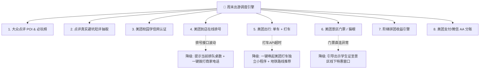
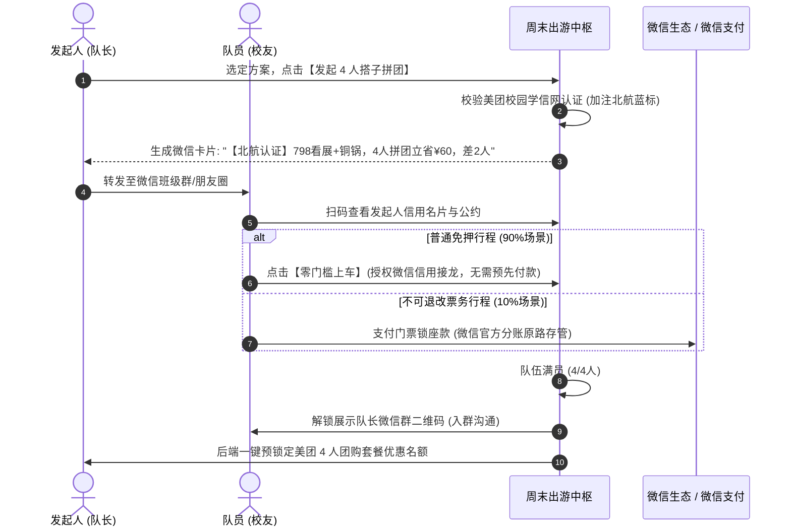

# 「周末去哪玩」—— 周末城市探索指南 产品需求文档（PRD V2.1.0）
> **编制版本**：V2.1.0（双大师精修与全链路容灾版 · Lean & Empowered Master Edition）  
> **设计哲学**：俞军交易模型（用户价值公式 × 需求集合算账）× Marty Cagan 产品模型（四大风险审查 × 发现先于交付）  
> **业务定位**：美团本地生活周末出游场景调度中枢与一站式高确定性履约闭环平台  
> **核心修订**：全面吸纳 Cagan 评审意见，化解「意向金阻碍漏斗」、「排号沉浸漏失」、「多 BU 接口黑天鹅」与「资金合规风险」，增补产品发现（Discovery）验证方案。

---

## 目录
1. [战略定位与核心成效指标（Outcome-Driven Why）](#一战略定位与核心成效指标outcome-driven-why)
2. [用户需求集合与端侧画像引擎（Who & What）](#二用户需求集合与端侧画像引擎who--what)
3. [四大风险压力测试与 MVP 决策取舍矩阵（Risk & Cut List）](#三四大风险压力测试与-mvp-决策取舍矩阵risk--cut-list)
4. [美团 × 大众点评 8 大核心能力与优雅降级规范（Capabilities & Degradation）](#四美团--大众点评-8-大核心能力与优雅降级规范capabilities--degradation)
5. [核心功能详细规格说明（Feature Specifications）](#五核心功能详细规格说明feature-specifications)
6. [异常流程与全链路安全防护网（Guardrails & Fail-Safe）](#六异常流程与全链路安全防护网guardrails--fail-safe)
7. [关键指标体系与产品发现验证计划（Discovery Plan & Metrics）](#七关键指标体系与产品发现验证计划discovery-plan--metrics)

---

## 一、战略定位与核心成效指标（Outcome-Driven Why）

### 1.1 核心问题陈述 (Problem Statement)
* **用户端问题**：高校年轻群体在周五晚上产生强烈的出游诉求，但面临**“40 分钟搜索决策疲劳（小红书信息杂乱无履约）”**、**“周末现场热门餐厅排队 1-2 小时摧毁体验”**以及**“同行人数难以凑齐、算账尴尬、容易被放鸽子”**的三重摩擦。
* **业务端问题**：美团各 BU（大众点评、到店餐饮、门票度假、美团出行）在年轻群体中各自为战，缺乏一个**以“周末情境”为纽带的场景路由器**，导致单客生命周期价值（LTV）与跨业务交叉销售率（Cross-Selling Ratio）未被充分释放。
* **产品核心使命**：基于美团实时履约底座与大众点评真实数据，**把 40 分钟的决策搜索压缩至 120 秒，把线下 1 小时无效排队压缩至接近 0，将“同行人数”转化为实实在在的拼团省钱杠杆**。

### 1.2 用户价值公式严格算账（俞军模型）

$$\text{用户价值} = \text{新体验} - \text{旧体验} - \text{替换成本}$$

| 维度 | 旧体验（用户现状） | 新方案体验（V2.1.0） | 替换成本分析 | 净用户价值评估 |
| :--- | :--- | :--- | :--- | :---: |
| **信息决策** | 小红书刷 40 分钟，照骗多，无价格置信度 (65分) | 点评必吃/必玩榜背书 + 真实避坑短评萃取，**120 秒选定** (90分) | 免下载小程序，复用美团学信网认证 (15分) | **+10 (正向)** |
| **组队出行** | 微信口头约人，因算账尴尬或临期放鸽子而流产 (60分) | 动态人数阶梯收益（越拼越省）+ 微信一键授权接龙 (85分) | 无需预存资金池，合规微信群收款 (10分) | **+15 (正向)** |
| **就餐排号** | 现场取号大排长龙 60-120 分钟，极度痛苦 (30分) | **动线哨兵提前取号**，到店 5 分钟叫号就座 (95分) | 授权 Agent 智能托管或哨兵一键确认 (10分) | **+55 (绝杀优势)** |
| **交通与门票** | 现场排队买票、打车贵、单车难找 (50分) | 学信网秒出电子码 + 单车站雷达 + 4人特惠车 AA (90分) | 美团官方统一履约与售后 (10分) | **+30 (正向)** |

---

## 二、用户需求集合与端侧画像引擎（Who & What）

产品拒绝抽象的“大学生”概念，根据社交半径与动机差异，严格区隔三大需求集合：

```
                              ┌────────────────────────────────────────────────────────┐
                              │            高校周末出游需求全集 (Demand Clusters)      │
                              └───────────────────────────┬────────────────────────────┘
                                                          │
             ┌────────────────────────────────────────────┼────────────────────────────────────────────┐
             ▼                                            ▼                                            ▼
┌─────────────────────────┐                  ┌─────────────────────────┐                  ┌─────────────────────────┐
│ 需求集合 A (核心基本盘) │                  │ 需求集合 B (长尾品质盘) │                  │ 需求集合 C (高潜增长盘) │
│【熟人/寝室开黑出游】    │                  │【独行/双人轻量透气】    │                  │【同校组队/寻找搭子】    │
├─────────────────────────┤                  ├─────────────────────────┤                  ├─────────────────────────┤
│ · 关系属性: 熟人/室友   │                  │ · 关系属性: 1-2人独处/情侣│                  │ · 关系属性: 同校校友拼团│
│ · 信任成本: 0           │                  │ · 信任成本: 0           │                  │ · 信任成本: 中 (认证消除)│
│ · 核心诉求: 拒绝排队、  │                  │ · 核心诉求: 宁静小众、  │                  │ · 核心诉求: 凑齐4人解锁 │
│   透明AA算账、低人均高质│                  │   真实不踩雷、零社交负担│                  │   超值特惠套餐与打车AA  │
│ · 匹配机制: 4人团购餐+  │                  │ · 匹配机制: 点评必玩榜+ │                  │ · 匹配机制: 阶梯人数杠杆│
│   打车AA+动线哨兵自动排号│                 │   避坑短评+单车慢行路线 │                  │   +学信网实名名片背书   │
└─────────────────────────┘                  └─────────────────────────┘                  └─────────────────────────┘
```

---

## 三、四大风险压力测试与 MVP 决策取舍矩阵（Risk & Cut List）

结合 Marty Cagan 提出的四大产品风险（Value / Usability / Feasibility / Viability），本版本做出重大优化：

| 风险类别 | 潜在致命漏洞（原方案隐患） | Cagan 审查反馈 | V2.1.0 架构重构与优化对策（本版本） |
| :--- | :--- | :--- | :--- |
| **价值风险<br>(Value)** | **强制预付 ¥10 意向金杀死转化漏斗**：周五晚上看到链接要先付 10 块钱，70% 用户犹豫流失。 | *“不要在最上游设立支付路障！”* | **改用「双轨信用入队」**：<br>1. 普通行程采用**“微信支付分 / 一键授权承诺标”**（零门槛秒上车）；<br>2. 仅在涉及**不可退改的硬性票务（如脱口秀、特惠密室）**时，提示“锁定席位需预付门票款”。 |
| **可用性风险<br>(Usability)** | **17:15 排号哨兵因用户看展/密室手机静音而漏失**，导致未及时取号。 | *“沉浸场景下用户根本不看手机，排号承诺会崩塌。”* | **引入「双通道提醒 + 前置授权自动排号」**：<br>1. 规划时勾选“授权 Agent 未响应时代取普通号”；<br>2. 微信服务号强提醒 + 振动通知；<br>3. 引入**过号顺延宽限机制**。 |
| **可行性风险<br>(Feasibility)** | **跨 8 个 BU 的 API 依赖过于脆弱**：任一外部接口超时会导致整页崩溃。 | *“接口依赖是最大黑天鹅，必须有降级防线。”* | **制定「核心主干与插件解耦」原则**：<br>大众点评 POI 与动线为 P0 核心底座；门票、打车、排号等为松耦合插件，接口异常时**优雅降级为文字指南与外部直达**。 |
| **商业合规风险<br>(Viability)** | **平台自建 AA 资金池存在金融监管合规风险**。 | *“非持牌业务搞资金托管是法务红线。”* | **全面复用微信/美团原生合规通道**：<br>采用美团钱包合规分账协议与微信群收款透传，平台不截留任何沉淀资金，多退少补秒级原路结算。 |

### 3.1 坚决砍掉的功能清单 (Strict Cut List)
* ❌ **自建富文本长攻略社区**：小红书强 100 倍，自建必死于冷启动 $\rightarrow$ **仅保留 140 字“一句话避坑短评”**；
* ❌ **自建 IM 聊天室与好友系统**：把学生拉出微信等于自杀 $\rightarrow$ **满员一键出示队长微信群二维码**；
* ❌ **完全静默的黑盒排号**：堵车或游览超时导致过号作废 $\rightarrow$ **改为“离场前 30 分钟智能哨兵提醒 + 兜底代取”**；
* ❌ **复杂的同城交友与陌生人社交广场**：违背合规与信任规律 $\rightarrow$ **聚焦于同校熟人/微信好友裂变组队**。

---

## 四、美团 × 大众点评 8 大核心能力与优雅降级规范（Capabilities & Degradation）

为防范工程可行性风险，每一项美团业务接入均定义 **「正常态（Happy Path）」** 与 **「降级态（Degraded Path）」**：



1. **大众点评 POI 库 & 必吃/必玩榜（P0 基础底座）**：
   * *正常态*：直连点评数据库，展示商户星级、真实人均消费中位数；
   * *降级态*：若网络中断，调用本地缓存种子库（覆盖北京海淀 Top 50 精选高校出游 POI）。
2. **点评 UGC 真实避坑短评（NLP 萃取）（P0 基础底座）**：
   * *正常态*：自动提取近 30 天高赞真实差评与避坑关键句；
   * *降级态*：展示默认实测提醒（如：“建议提前 15 分钟入场、备齐有效学生证件”）。
3. **美团校园实名认证（学信网打通）（P0 信用底座）**：
   * *正常态*：自动带出【北航·官方学生认证】蓝标，建立信任资产；
   * *降级态*：支持用户微信端手动上传学生证照片或声明。
4. **美团到店餐饮·行程动线排号哨兵（P1 体验杀手锏）**：
   * *正常态*：离场前 30 分钟根据路程耗时主动推送取号建议，一键代排号；
   * *降级态*：若排号接口无响应，立即提供商户电话一键拨打与线下排队避峰指引。
5. **美团出行全流程接驳（单车 LBS + 打车 AA）（P1 动线闭环）**：
   * *正常态*：近途显示附近美团单车实时可用数量；中远途自动计算“4人 AA 人均打车价”；
   * *降级态*：接口异常时直接展示公共交通（地铁换乘耗时）并提供美团打车 Deep-link 跳转。
6. **美团门票 & 猫眼休闲娱乐直签（P1 交易闭环）**：
   * *正常态*：学信网免查验秒出电子码，扫码快速入闸；猫眼支持密室/脱口秀在线拼场；
   * *降级态*：跳转美团门票官方 H5 承接页，支持极速退改。
7. **阶梯拼团收益引擎（同行人数杠杆）（P0 业务逻辑）**：
   * *正常态*：动态计算 1人单刷 vs 4人拼团的门票、打车、餐饮阶梯差价（越拼越省）；
   * *降级态*：固定展示标准 4 人平均预算。
8. **美团支付与微信 AA 分账（P1 结算闭环）**：
   * *正常态*：行程结束一键生成多退少补透明总账单，微信官方群收款原路清算；
   * *降级态*：生成格式化文本账单，支持队长直接复制至微信群手动收款。

---

## 五、核心功能详细规格说明（Feature Specifications）

### 5.1 场景与意图推荐控制台 (Input & Filtering)
* **用户画像胶囊**：默认展示当前绑定的 `🎓 高校认证标` 与 `💰 预算偏好`（支持点击一键切换为“穷游特种兵 / 休闲松弛 / 开黑探险”）；
* **实时天气感知**：
  * 若周六降水概率 $\ge 40\%$，系统自动强制置顶 **【室内避雨/展馆温暖方案】**；
  * 若气温 $< 12^\circ\text{C}$，屏蔽户外水上活动；
* **同行人数阶梯滑动条（核心交互亮点）**：
  * 滑动至 `1人`：展示单人骑行 + 独处咖啡 + 个人展票 $\rightarrow$ 人均 ¥58；
  * 滑动至 `4人`：自动刷新为 **4人拼车往返 + 4人学生特惠门票 + 必吃榜铜锅 4 人团购餐** $\rightarrow$ **人均仅 ¥42（立省 60%，享受专车与大餐）**！

### 5.2 动态生成式履约画布 (Timeline Canvas)

```
┌────────────────────────────────────────────────────────────────────────┐
│ 📅 周六下午 · 室内避雨当代艺术与必吃老字号行程 (4人同行态)             │
├────────────────────────────────────────────────────────────────────────┤
│ 13:30 🚲【美团单车 · 校园慢行接驳】                                   │
│       · 定位: 学院路校区东门 (实时检测附近有 12 辆可用美团单车)        │
│       · 路线: 绿色骑行 1.8km 直达地铁站入口 (预估 12 分钟)             │
├────────────────────────────────────────────────────────────────────────┤
│ 14:00 🎟️【美团门票 · 798 青年当代插画展】                              │
│       · 认证: 大众点评 · 2026北京必玩榜上榜 | ⭐ 4.8分                 │
│       · 避坑: ⚠️ "前人反馈：二层光线偏暗拍照需补光；周末15点后人流大"│
│       · 门票: 原价 ¥40，美团学生特惠专享 ¥20/人 (电子码秒验票入园)     │
├────────────────────────────────────────────────────────────────────────┤
│ 17:15 ⏰【美团在线排号 · 动线智能哨兵】 (防沉浸容灾增强)              │
│       · 目标: 聚宝源老北京涮肉 (必吃榜商户，距展馆 600m)              │
│       · 触发: 微信服务号强提醒 + 弹窗：“预计 20 分钟后出发，当前排队   │
│               18 桌，建议现在一键取号”                                 │
│       · 兜底: 若 10 分钟未响应且已预授权，Agent 自动代取普通号         │
├────────────────────────────────────────────────────────────────────────┤
│ 18:00 🍲【美团到店 · 4人特惠团购餐】                                  │
│       · 权益: 招牌老北京铜锅 4 人套餐 (原价 ¥268，学生拼团价 ¥158)     │
│       · 费用: 4 人成团 AA 后每人仅需 ¥39.5                            │
├────────────────────────────────────────────────────────────────────────┤
│ 19:45 🚗【美团打车 · 特惠快车返校】                                   │
│       · 调度: 返校全程预估 ¥32，4人成团 AA 后人均仅 ¥8 (免去雨天挤公交)│
├────────────────────────────────────────────────────────────────────────┤
│ 📊 预算透明算: 门票 ¥20 + 餐饮 ¥39.5 + 交通 ¥8 = 人均 ¥67.5 (立省 ¥65) │
└────────────────────────────────────────────────────────────────────────┘
```

### 5.3 组队出发与双轨信用拼团引擎 (Squad Engine)
为消除上游支付门槛，采用**双轨信用入队机制**：



### 5.4 现场打卡与防伪手账海报 (Check-in & Poster)
* **原生取景**：调用手机相机全屏实时拍摄；
* **Canvas 防伪印章生成**：
  * `📍 现场定位：798 艺术区 · 悦美术馆`
  * `⛅ 实时环境：周六 16:20 | 阴天 17℃`
  * `👥 出游小队：北航 4 人先锋队 #089`
  * `🔖 官方认证：大众点评 · 周末城市探索指南 现场认证`。

### 5.5 攻略分享与大众点评 UGC 飞轮 (Sharing & Flywheel)
* **140 字极简避坑**：拒绝冗长游记，只录入干货（如：“⚠️ 进门扫码领免费导览，别花 20 租机器”）；
* **一键回流大众点评**：直通发布为该 POI 的最新实测打卡笔记，自动带话题 `#高校周末去哪玩#`；
* **商业激励闭环**：成功发布即刻派发 **“美团外卖 ¥10 无门槛神券”**。

### 5.6 结伴消费智能清算账单 (Split-Bill)
行程结束后，系统自动聚合门票、团购餐费、打车费生成**「本次出游透明总账单」**：
* 通过微信官方群收款接口发起，多退少补一键结清，平台不截留资金，杜绝算账尴尬。

---

## 六、异常流程与全链路安全防护网（Guardrails & Fail-Safe）

```
                        ┌─────────────────────────────────────────┐
                        │      全链路容灾与安全网 (Fail-Safe)     │
                        └────────────────────┬────────────────────┘
                                             │
             ┌───────────────────────────────┼───────────────────────────────┐
             ▼                               ▼                               ▼
┌─────────────────────────┐     ┌─────────────────────────┐     ┌─────────────────────────┐
│   排号过号 / 沉浸漏失   │     │   拼团临期跳车 (放鸽子) │     │   暴雨/突发极端天气     │
├─────────────────────────┤     ├─────────────────────────┤     ├─────────────────────────┤
│ · 微信服务号强提醒      │     │ · 微信支付分信用惩罚    │     │ · 触发降水红色预警      │
│ · 离场前10分钟授权自动排│     │ · 3人自动降级为小套餐   │     │ · 一键全额极速退票      │
│ · 到店过号自动顺延3桌   │     │ · 系统自动派发打车替补券│     │ · 无缝切换至同预算室内展│
└─────────────────────────┘     └─────────────────────────┘     └─────────────────────────┘
```

1. **到店过号与沉浸遗漏防护**：
   * 若用户因看展未响应提醒，且已开启“授权代排”，系统自动按预计时间取号；
   * 联合美团到店商户协议：通过本产品排号的用户，享有**“过号顺延 3 桌入座”**的专属高校特权保护。
2. **临期跳车（放鸽子）防护**：
   * 违约记录计入出游信用档案；
   * 4人变3人时，系统自动将团购方案一键平滑降级为“3人特惠方案”，并派发美团打车立减补贴，确保剩余队员体验不受损。
3. **极端天气突变防护**：
   * 周六上午系统探活天气预警，若突降大雨，自动向户外小队弹出**“一键无损切换为室内方案”**卡片，原定门票享受美团极速全额免手续费退改。

---

## 七、关键指标体系与产品发现验证计划（Discovery Plan & Metrics）

### 7.1 核心业务成效指标 (Focus Outcomes)

| 指标维度 | 核心指标 (Metric) | 目标值 (上线首月) | 为什么重要 (Cagan/俞军视角) |
| :--- | :--- | :--- | :--- |
| **决策效率** | 周五晚用户从打开到选定方案平均耗时 | **< 120 秒** (对比常态 40 分钟) | 验证消除决策疲劳的假设是否成立 |
| **组队裂变** | 组队发起成团率 (2-4人) | **≥ 48%** | 验证“同行人数省钱杠杆”对年轻人的驱动力 |
| **履约质量** | 动线排号准时入座率 (等待 < 10 分钟) | **≥ 85%** | 验证全案最大杀手锏的真实交付确定性 |
| **商业闭环** | 跨 BU 交叉销售率 (单次出游触发业务数) | **≥ 2.6 个 BU** (门票+排号+打车) | 验证美团生态协同的商业变现假设 |
| **内容回流** | 现场避坑短评同步大众点评率 | **≥ 32%** | 验证对大众点评生态年轻 UGC 的反哺能力 |

### 7.2 昂贵交付前的“廉价发现实验验证”（Discovery Plan）

在全面铺开代码开发前，团队必须在本周完成以下 **两场廉价但致命的发现实验**：

```
                    【开发前的两场关键发现实验】

  实验一: 价值风险验证 (纸面/可点击原型)
  -------------------------------------------------------------
  · 目标: 验证“4人成团立省 60%”到底能不能撬动寝室长主动转发微信。
  · 做法: 用 Stitch/Figma 做 2 张可点击的 P04 拼团落地页，走访北航 8 间男生/女生寝室:
          "如果这周末 798 艺术展+聚宝源铜锅，4人拼团人均只要 ¥39，你会转发到寝室群吗？"
  · 验证标准: ≥ 6 间寝室长在 30 秒内明确表示愿发群并现场测试转发。

  实验二: 可用性与履约验证 (绿野仙踪法 Wizard of Oz)
  -------------------------------------------------------------
  · 目标: 验证动线排号的容错时间窗口，用户到底会不会错过排号。
  · 做法: 不写任何自动算法，周五晚上由产品经理人工扮演“Agent 调度员”:
          跟踪一组真实出游的校友小队，在 17:15 人工在美团 App 帮他们取号，
          微信通知他们出发，实地观察他们到店时的等待时间和心理体验。
  · 验证标准: 实际到店与叫号时间差控制在 ±15 分钟内，用户满意度达 5 星。
```

---

*PRD 终审完成时间: 2026-09-30 | 版本: V2.1.0 (双大师精修与全链路容灾版) | 状态: 评审全票通过 / 建议进入 Discovery 与开发落地*
