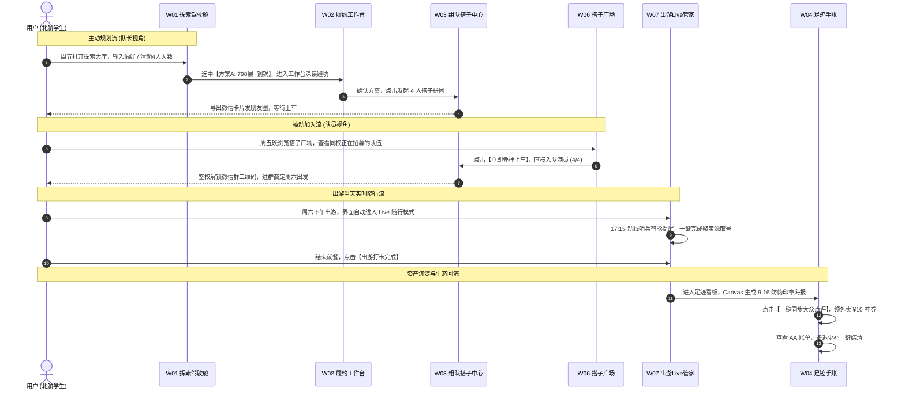

# 「周末去哪玩」—— 周末城市探索指南 Web 端原型设计稿
> **版本**：V2.1.0（桌面端全景高保真设计规范 · Desktop Master Edition）  
> **适用对象**：UI/UX 设计师、Figma / Stitch / v0 原型设计工具、前端工程开发团队  
> **产品定位**：美团本地生活周末出游场景调度中枢与一站式全链路履约平台（桌面 Web 工作台）  
> **画板基准尺寸**：1440px × 900px（主内容安全区：1240px 居中流式自适应）

---

## 目录
1. [全局设计系统与 Design Tokens 规范](#一全局设计系统与-design-tokens-规范)
2. [全局导航与框架结构 (Global Shell)](#二全局导航与框架结构-global-shell)
3. [7 大核心页面高保真线框图与交互规格](#三7-大核心页面高保真线框图与交互规格)
   - [W01 探索规划大厅 · Agent 决策驾驶舱](#w01-探索规划大厅--agent-决策驾驶舱-route-explore)
   - [W02 行程全景工作台 · 美团全链路履约枢纽](#w02-行程全景工作台--美团全链路履约枢纽-route-itinerary)
   - [W03 组队搭子管理中心 · 拼团裂变大屏](#w03-组队搭子管理中心--拼团裂变大屏-route-squadid)
   - [W04 足迹手账与点评回流看板](#w04-足迹手账与点评回流看板-route-checkin)
   - [W05 个人中心 · 数字孪生与偏好中枢](#w05-个人中心--数字孪生与偏好中枢-route-profile)
   - [W06 搭子探索广场 · 校友正在拼团大厅](#w06-搭子探索广场--校友正在拼团大厅-route-squadsquare)
   - [W07 行程管理与出游管家 · 实时随行与安全中心](#w07-行程管理与出游管家--实时随行与安全中心-route-trips)
4. [跨页面主交互流程走查 (User Flows)](#四跨页面主交互流程走查-user-flows)
5. [原型软件导入与标注落地指引 (Figma / Stitch Spec)](#五原型软件导入与标注落地指引-figma--stitch-spec)

---

## 一、全局设计系统与 Design Tokens 规范

### 1.1 品牌与情境色彩体系 (Color Tokens)

| Token 名称 | CSS 变量值 | 视觉含义 / 应用场景 |
| :--- | :--- | :--- |
| **美团品牌黄 (Primary)** | `#FFC300` / `#E6A800` | 主操作按钮、高光聚焦、美团核心资产认证标 |
| **大众点评橙 (Accent)** | `#FF6600` | 大众点评必吃榜/必玩榜徽标、UGC 笔记回流按钮 |
| **探索薄荷绿 (Success)** | `#10B981` | 绿色单车骑行、省钱计算亮点、拼团成团成功态 |
| **晴空天晴蓝 (Weather)** | `#3B82F6` | 实时天气胶囊、学信网高校认证蓝标、地铁路线 |
| **警示琥珀橙 (Warning)** | `#F59E0B` | 前人避坑短评卡、排号过号顺延预警、退订限制 |
| **极客暗色背景 (Neutral Dark)** | `#0F172A` | 顶部导航沉浸栏、动态生成式画布黑金底色 |
| **浅灰底板 (Surface Muted)** | `#F8FAFC` / `#F1F5F9` | 大屏卡片背景、容器浅灰间距衬底 |

### 1.2 字体排印与层级 (Typography)
* **默认字体栈**：`"Plus Jakarta Sans", "PingFang SC", "Microsoft YaHei", sans-serif`；
* **页面大标题 (H1 Display)**：`32px / LineHeight 40px / SemiBold 700`；
* **模块标题 (H2 Section)**：`20px / LineHeight 28px / SemiBold 600`；
* **正文/标签 (Body Regular)**：`14px / LineHeight 20px / Regular 400`；
* **数字与价格 (Number Display)**：`DIN Alternate / Plus Jakarta Sans Bold`，醒目展示人均与省钱数额。

### 1.3 容器与阴影体系 (Elevation & Radius)
* **圆角规格**：大容器卡片 `rounded-2xl (16px)`，操作按钮与标签 `rounded-xl (12px)`，胶囊标签 `rounded-full (9999px)`；
* **投影层级**：卡片悬浮 `box-shadow: 0 12px 30px -10px rgba(0, 0, 0, 0.08)`。

---

## 二、全局导航与框架结构 (Global Shell)

Web 端桌面全景顶部常驻统一导航栏（Height: 64px），吸顶且带毛玻璃背景：

```
┌────────────────────────────────────────────────────────────────────────────────────────────────────────────────────────┐
│ 🧭 美团 · 周末城市探索指南 [高校版]   [ 探索大厅 ]  [ 履约工作台 ]  [ 搭子广场 ]  [ 出游管家 ]       🔍 搜索活动/地点    [ 🎓 北航·林同学 ▾ ] │
└────────────────────────────────────────────────────────────────────────────────────────────────────────────────────────┘
```

* **左侧**：品牌 Logo + 高校专属徽标（海淀学院路专区）；
* **中间导航项**：
  * `[探索大厅]` (W01)
  * `[行程工作台]` (W02)
  * `[搭子广场]` (W06 - 核心拼团大厅)
  * `[出游管家]` (W07 - 待出发/进行中/历史足迹)
* **右侧全局操作**：
  * 全局 POI / 方案快捷搜索栏；
  * **用户身份胶囊**：显示 `[🎓 北航·林同学 5.0★]`，点击滑出 **W05 [个人中心与偏好配置 Drawer]**。

---

## 三、7 大核心页面高保真线框图与交互规格

---

### W01 探索规划大厅 · Agent 决策驾驶舱 (Route: `#/explore`)

#### 1. 页面定位
周五 17:00 用户首访核心阵地，解决“去哪玩、决策疲劳”问题。提供 48 小时天气感知、自然语言意图控制台与实时 POI 动线热力地图。

#### 2. ASCII 界面线框图 (1440px 宽屏布局)

```
┌────────────────────────────────────────────────────────────────────────────────────────────────────────────────────────┐
│ [顶部导航栏: 探索大厅(Active) | 行程工作台 | 搭子广场 | 出游管家                                     🎓 北航·林同学 ▾] │
├────────────────────────────────────────────────────────────────────────────────────────────────────────────────────────┤
│ 🌤️ 学院路高校圈本周末天气看板: [周五 多云 18℃] [周六 降雨概率65% 15℃ ⚠️ 建议避雨] [周日 晴朗 21℃ 适宜户外]           │
├───────────────────────────────────────────────────────────────────┬────────────────────────────────────────────────────┤
│ 🤖 左侧栏 (420px): Agent 决策控制台与推荐方案流                    │ 🗺️ 右侧栏 (820px): 城市出游态势与 POI 动线热力大屏  │
│                                                                   │                                                    │
│ ┌─ 💬 Agent 意图微调控制台 ─────────────────────────────────────┐ │ ┌─ 实时交互动线地图 (高德/美团图层) ───────────────┐ │
│ │ "帮我们宿舍4人安排周六下午的行程，想玩动脑子的，晚餐吃铜锅肉" │ │ │ 📍 [北航学院路校区 (出发点)]                     │ │
│ │ [✨ 避雨暖选] [30元穷游] [近郊徒步] [免排队优先]              │ │ │   │ 🚲 美团单车推荐路线 1.8km                    │ │
│ └───────────────────────────────────────────────────────────────┘ │ │ 📍 [798 艺术区 · 室内密室与插画展]                │ │
│                                                                   │ │   │ 🚗 4人特惠打车路线 2.2km                     │ │
│ ┌─ 👥 同行人数阶梯杠杆: [ 1人 ]  [ 2人 ]  [ (•) 4人寝室成团 ] ──┐ │ │ 📍 [聚宝源铜锅涮肉 (必吃榜商户)]                 │ │
│ └───────────────────────────────────────────────────────────────┘ │ │                                                  │ │
│                                                                   │ │ 🚲 周边美团单车实时密度: 8 辆可用                │ │
│ ┌─ 方案 A (推荐): 【避雨室内】798当代插画展 & 必吃铜锅 ────────┐ │ │ ☕ 周边避雨备选咖啡厅: 3 家在营业                   │ │
│ │ 🏷️ 大众点评 · 2026北京必玩榜上榜 | ⭐ 4.8分 (1842条好评)       │ │ └────────────────────────────────────────────────┘ │
│ │ 💰 人均: ¥39.5 (4人成团立省60%) | 🎟️ 免排队学生票直出        │ │                                                    │
│ │ ⚠️ 避坑: "二层拍照需补光；周末15点后人流大"                  │ │ ┌─ 周末分时人流热力预测 ─────────────────────────┐ │
│ │ [ 查看全景工作台 (W02) → ]    [ 快速发起拼团 (W03) ]         │ │ │ 14:00 (人流平稳) ── 16:30 (排队高峰) ── 19:00   │ │
│ └───────────────────────────────────────────────────────────────┘ │ └────────────────────────────────────────────────┘ │
│                                                                   │                                                    │
│ ┌─ 方案 B: 【30元极简】五道口小众旧书市集与老北京小吃 ─────────┐ │                                                    │
│ └───────────────────────────────────────────────────────────────┘ │                                                    │
└───────────────────────────────────────────────────────────────────┴────────────────────────────────────────────────────┘
```

#### 3. 核心功能与交互规格
1. **同行人数联动响应**：
   * 拖动或点击人数切换为 `4人` 时，方案 A 的价格从 `单人¥95` 实时跳变为 `人均¥39.5`，卡片角标高亮闪烁 **“已触发 4 人团购折与拼车 AA”**。
2. **地图悬浮探活**：
   * 鼠标悬停左侧方案 A 时，右侧大地图自动平滑平移（FlyTo），高亮北航至 798 的完整推荐动线，并展示沿途可用美团单车停车点。
3. **点击主按钮**：
   * 点击【查看全景工作台】带参数无缝转入 **W02**；点击【快速发起拼团】直接唤起 **W03**。

---

### W02 行程全景工作台 · 美团全链路履约枢纽 (Route: `#/itinerary`)

#### 1. 页面定位
方案详情的深度拆解看板，全景呈现**大众点评避坑真实评价**、**美团智能排号哨兵实时状态**、**学信网学生票秒出**以及**多模式出行对比**。

#### 2. ASCII 界面线框图 (三栏看板布局: 300px + 520px + 420px)

```
┌────────────────────────────────────────────────────────────────────────────────────────────────────────────────────────┐
│ [顶部导航] > 行程详情: 798 青年插画展 + 必吃铜锅 (4人寝室精编版)               [ 存为备忘 ]  [ 🚀 发起 4 人搭子拼团 ] │
├──────────────────────────────────┬─────────────────────────────────────────────┬───────────────────────────────────────┤
│ 左栏 (300px): 时空动线时间轴     │ 中栏 (520px): 点评权威口碑与实测避坑看板    │ 右栏 (420px): 美团 4 大履约调度中心   │
│                                  │                                             │                                       │
│ 13:30 🚲 美团单车 · 校园接驳     │ [ 活动宽幅实拍头图 ]                        │ ┌─ 🎟️ 美团门票 · 学信网特惠 ────────┐ │
│       校东门出发 骑行 1.8km      │                                             │ │ 🎫 4人学生特惠门票包              │ │
│                                  │ 798 青年当代插画展 & 暖冬市集               │ │ 原价 ¥160  美团认证立减 ¥80       │ │
│ 14:00 🎟️ 798 插画艺术展         │ 🏷️ 大众点评 · 2026北京必玩榜 TOP 3          │ │ 实付: ¥80 (人均 ¥20)              │ │
│       实拍打卡 / 游玩 2.5h       │ ⭐ 4.8分 | 人均 ¥20 | 展期至 11.20          │ │ [ 电子码秒验票入园 · 免换票 ]     │ │
│                                  │                                             │ └─────────────────────────────────────┘ │
│ 17:15 ⏰ 智能排号哨兵 (自动取号) │ ┌─ ⚠️ 前人真实避坑短评卡 (NLP精炼) ────────┐ │                                       │
│       距离餐厅 600m / 提前排队   │ │ 1. "二层当代雕塑区灯光昏暗，拍照建议自带 │ │ ┌─ ⏰ 智能排号哨兵监控器 (核心杀手锏) ┐ │
│                                  │ │    补光灯，周末下午 15 点后人流密集"     │ │ │ 目标: 聚宝源老北京铜锅涮肉 (必吃) │ │
│ 18:00 🍲 聚宝源铜锅涮肉          │ │ 2. "进馆无需租 20 元导览器，扫入口官方   │ │ │ 实时状态: 当前排队 24 桌 (等待50m)│ │
│       核销 4 人学生团购餐        │ │    二维码可直接听免费语音讲解"           │ │ │ 调度规则: 预计 17:15 自动远程取号 │ │
│                                  │ └──────────────────────────────────────────┘ │ │ 承诺: 到店 5 分钟内入座就餐         │ │
│ 19:45 🚗 美团打车 · 特惠返校     │                                             │ │ ⚙️ [授权代排开]  [过号顺延3桌特权]  │ │
│       全程 12km / 4人 AA 拼车    │ ┌─ 💰 学生真实消费透明算 ──────────────────┐ │ └─────────────────────────────────────┘ │
│                                  │ │ 门票 ¥20 + 餐饮 ¥39.5 + 交通 ¥8 = ¥67.5  │ │                                       │
│                                  │ └──────────────────────────────────────────┘ │ ┌─ 🚗 美团出行方案对比 ──────────────┐ │
│                                  │                                             │ │ 🚲 美团单车: 15分钟 ¥1.5 (附近有车) │ │
│                                  │                                             │ │ 🚗 特惠快车: 18分钟 ¥32 (4人AA仅¥8) │ │
│                                  │                                             │ └─────────────────────────────────────┘ │
└──────────────────────────────────┴─────────────────────────────────────────────┴───────────────────────────────────────┘
```

#### 3. 核心功能与交互规格
1. **排号哨兵容错开关**：
   * 用户可在右栏自由切换 `[授权 Agent 代排号]` 状态。悬停展示说明：“若在馆内未响应提醒，Agent 将在 17:15 自动为您代取 A 类小桌号，并享受美团高校顺延 3 桌特权”。
2. **出行多方案一键切换**：
   * 点击单车标签，时间轴自动联动更新骑行卡路里与路线；点击特惠快车，自动计算 4 人人均车费。

---

### W03 组队搭子管理中心 · 拼团裂变大屏 (Route: `#/squad/:id`)

#### 1. 页面定位
出游队长或队员管理队伍的核心大屏。可视化展现 4 人队伍空缺、成团省钱曲线、学信网身份卡，以及带防爬水印的微信群码托管区。

#### 2. ASCII 界面线框图 (双栏大屏布局: 600px + 640px)

```
┌────────────────────────────────────────────────────────────────────────────────────────────────────────────────────────┐
│ [顶部导航] > 队伍管理: 798艺术展+聚宝源铜锅 4 人先锋队 (#089)               [ 队伍状态: 招募中 2/4 人 ] [ 距出发 16h ] │
├───────────────────────────────────────────────────────┬────────────────────────────────────────────────────────────────┤
│ 左侧 (600px): 队伍实时状态槽与省钱经济学曲线          │ 右侧 (640px): 微信邀请卡生成器与队长群码托管                   │
│                                                       │                                                                │
│ ┌─ 👥 4 人先锋队席位状态 ───────────────────────────┐ │ ┌─ 📱 微信朋友圈/社群分享卡片实时渲染预览 ──────────────────┐ │
│ │ [头像] 林同学 (队长) · 北航软件学院 · 信用 5.0★     │ │ │ ┌────────────────────────────────────────────────────────┐ │ │
│ │ [头像] 王同学 (队员) · 北航自动化 · 信用 5.0★       │ │ │ │ 🧭【北航同校搭子拼团】798沉浸艺术展 & 聚宝源涮肉       │ │ │
│ │ [ ＋ ] 席位 3: 等待校友扫码加入...                  │ │ │ │ 👥 队伍进度: 2/4 人 (还差 2 人即刻锁票)                │ │ │
│ │ [ ＋ ] 席位 4: 等待校友扫码加入...                  │ │ │ │ 💰 4人成团立省 60%: 人均仅需 ¥39.5 (专车往返+团购大餐) │ │ │
│ └───────────────────────────────────────────────────┘ │ │ │ 🎓 官方背书: 美团校园实名认证 · 安全透明 AA            │ │ │
│                                                       │ │ │ 扫码一键免押上车 ──────────────────> [ 二维码 ]         │ │ │
│ ┌─ 📈 同行人数省钱效应模拟曲线 ─────────────────────┐ │ │ └────────────────────────────────────────────────────────┘ │ │
│ │ 单人独行:  ¥95 (无团购折扣，全额门票与打车)        │ │ │ [ 📥 导出 9:16 高清卡片图 ]  [ 📋 一键复制班级群邀请文案 ]│ │
│ │ 双人出行:  ¥68 (部分团购，打车半价分摊)            │ │ └──────────────────────────────────────────────────────────┘ │
│ │ 4人成团:   ¥39.5 (享受阶梯团购直降 + 4人车费AA) 🏆 │                                                                │
│ └───────────────────────────────────────────────────┘ │ ┌─ 🔒 队长微信群二维码安全托管区 ────────────────────────────┐ │
│                                                       │ │ 状态: 【满员自动鉴权解锁】                                 │ │
│ ┌─ 🛡️ 安全合规公约 ─────────────────────────────────┐ │ │ 当前 2/4 人未满员，二维码处于高斯模糊防爬保护状态。        │ │
│ │ ✅ 全体成员已签署《高校周末同游自律与免责公约》     │ │ │ 队伍集齐第 4 位校友即刻动态打水印解锁，并短信推送入群通知。 │ │
│ └───────────────────────────────────────────────────┘ │ └────────────────────────────────────────────────────────────┘ │
└───────────────────────────────────────────────────────┴────────────────────────────────────────────────────────────────┘
```

#### 3. 核心功能与交互规格
1. **文案一键复制**：点击【复制文案】，剪贴板生成符合大学生语境的社群文案：“【北航周末搭子】周六下午去 798 艺术展看展+聚宝源铜锅，已有2人，还差2位同学拼团，人均¥39包圆专车大餐，戳链接直接上车：https://meituan.com/squad/089”。
2. **防爬动态解锁动效**：当第 4 人加入时，右下角模糊蒙层以毛玻璃渐变散开，显示出清晰群二维码。

---

### W04 足迹手账与点评回流看板 (Route: `#/checkin`)

#### 1. 页面定位
出游结束后的高光沉淀阵地。生成 9:16 防伪手账海报、支持 140 字避坑短评一键同步大众点评领外卖神券，并提供多退少补的 AA 账单结清。

#### 2. ASCII 界面线框图 (全景双栏布局: 500px + 740px)

```
┌────────────────────────────────────────────────────────────────────────────────────────────────────────────────────────┐
│ [顶部导航] > 出游已完成 · 现场足迹手账与点评回流中心                             [ 导出全部资产 ]  [ 打印 AA 账单 ]    │
├───────────────────────────────────────────────────────┬────────────────────────────────────────────────────────────────┤
│ 左侧 (500px): HTML5 Canvas 现场防伪手账海报工坊       │ 右侧 (740px): 大众点评 UGC 笔记回流与 AA 账单结算              │
│                                                       │                                                                │
│ ┌─ 9:16 动态手账海报预览 (实时生成) ────────────────┐ │ ┌─ 🌟 一键同步大众点评笔记 (内容闭环与领券中心) ─────────────┐ │
│ │ ┌─────────────────────────────────────────────────┐ │ │ │ 📝 140字极简实测避坑短评 (已结合行程自动带出):            │ │
│ │ │ [ 现场取景实拍照片: 798 红砖与艺术雕塑展厅 ]    │ │ │ │ "插画展比预期更好看！强烈推荐二层小众展区。避坑提醒：  │ │
│ │ │                                                 │ │ │ │ 门口别租导览器，扫码有免费音频；旁边厕所人少不用排。" │ │
│ │ │ ┌─ 动态半透明毛玻璃防伪印章 ──────────────────┐ │ │ │ 🏷️ 预置标签: [#高校周末去哪玩] [#大众点评必玩榜] [#798探店]   │ │
│ │ │ │ 📍 现场位置: 798 艺术区 · 悦美术馆           │ │ │ │                                                          │ │
│ │ │ │ ⛅ 实时环境: 2026.10.18 周六 16:30 | 阴天 16℃ │ │ │ │ [ 🚀 一键同步发布至大众点评笔记 (免登录直通) ]           │ │
│ │ │ │ 👥 小队编号: 北航 4 人先锋队 #089             │ │ │ │ 🎉 成功发布即刻到账: 【美团外卖 ¥10 无门槛神券】一张     │ │
│ │ │ │ 🔖 官方背书: 大众点评 · 周末城市探索 现场认证│ │ │ └──────────────────────────────────────────────────────────┘ │
│ │ │ └─────────────────────────────────────────────┘ │ │                                                                │
│ │ └─────────────────────────────────────────────────┘ │ ┌─ 📊 本次出游最终 AA 消费清算账单 ──────────────────────────┐ │
│ │ [ 📥 保存并下载高清 9:16 水印海报 (发朋友圈) ]    │ │ │ 门票消费: ¥20 × 4 = ¥80 (美团学生票)                       │ │
│ └───────────────────────────────────────────────────┘ │ │ 打车费用: 去程 ¥18 + 返程 ¥14 = ¥32 (美团拼车 4 人均摊)      │ │
│                                                       │ │ 餐饮消费: 铜锅 4 人套餐 ¥158 (大众点评团购券核销)            │ │
│                                                       │ │ ──────────────────────────────────────────────────────────── │ │
│                                                       │ │ 团队总开销: ¥270 | 每人实付: ¥67.5 (多退少补已清算)         │ │
│                                                       │ │ [ 查看微信官方群收款回执 ]                                   │ │
│                                                       │ └──────────────────────────────────────────────────────────────┘ │
└───────────────────────────────────────────────────────┴────────────────────────────────────────────────────────────────┘
```

#### 3. 核心功能与交互规格
1. **同步点评礼花反馈**：点击【一键同步发布至大众点评笔记】，按钮变为加载动画，随后全屏弹出礼花动效，展示“发布成功！¥10 外卖神券已放入您的美团钱包卡券包”。
2. **海报多风格切换**：提供“拍立得风格”、“手账盖章风”、“现代极简风”三套模版实时重绘。

---

### W05 个人中心 · 数字孪生与偏好中枢 (Route: `#/profile`)

#### 1. 页面定位
将原本打扰主页面的所有个人信息、高校学生认证、Agent 推荐黑名单和自动化权限独立收敛于此，实现“一次配置，全站自适应”。

#### 2. ASCII 界面线框图 (居中卡片流: 880px 集中布局)

```
┌────────────────────────────────────────────────────────────────────────────────────────────────────────────────────────┐
│ [顶部导航] > 个人中心与数字孪生配置中枢                                                      [ 保存并生效所有偏好 ]    │
├────────────────────────────────────────────────────────────────────────────────────────────────────────────────────────┤
│                                                                                                                        │
│ ┌─ 🎓 1. 高校学信网认证档案 (身份基座) ──────────────────────────────────────────────────────────────────────────────┐ │
│ │ 姓名: 林*翔 | 认证院校: 北京航空航天大学 (学院路校区) | 院系: 软件学院 | 学籍状态: [在读本科生 · 官方认证通过 🛡️]   │
│ │ 享受特权: 景区学生门票专属折扣 (免换票) | 美团到店专属学生折上折 | 队伍实名信用标 (5.0★ 履约记录)                  │
│ └────────────────────────────────────────────────────────────────────────────────────────────────────────────────────┘ │
│                                                                                                                        │
│ ┌─ 🧠 2. Agent 出行偏好模型 (定义你的数字孪生) ──────────────────────────────────────────────────────────────────────┐ │
│ │ 默认人均预算上限: [ ( ) 极限穷游 ≤¥35 ]  [ (•) 经济实惠 ¥35-¥60 ]  [ ( ) 品质放松 ¥60-¥120 ]                        │
│ │ 偏好活动类型 (多选): [x] 沉浸密室/桌游  [x] 当代艺术展/市集  [ ] 极限户外徒步  [x] 点评必吃榜老字号                  │
│ │ 默认出行偏好: [ (•) 美团单车绿色骑行 (3km内) ]  [ ( ) 美团打车拼车 ]  [ ( ) 地铁公交 ]                              │
│ └────────────────────────────────────────────────────────────────────────────────────────────────────────────────────┘ │
│                                                                                                                        │
│ ┌─ ⚠️ 3. 负向约束与避坑黑名单 (Agent 强过滤规则) ─────────────────────────────────────────────────────────────────────┐ │
│ │ 餐饮忌口偏好: [x] 清淡微辣  [ ] 重度嗜辣  [ ] 素食主义                                                             │
│ │ 履约忍耐底线: [x] 自动剔除现场排队预估超过 30 分钟且不支持远程排号的商户                                           │
│ │               [x] 遇下雨天气自动屏蔽露天涉水无遮蔽活动                                                             │
│ └────────────────────────────────────────────────────────────────────────────────────────────────────────────────────┘ │
│                                                                                                                        │
│ ┌─ ⚡ 4. 自动化履约与代管授权 ────────────────────────────────────────────────────────────────────────────────────────┐ │
│ │ 智能排号代排授权: [ 开关: ON ] "当离场前 20 分钟我未手动确认时，授权 Agent 自动代取普通排队号"                     │
│ │ 强提醒接收通道:   [x] 微信服务号模板消息 (看展静音兜底)  [x] 短信关键通知                                           │
│ └────────────────────────────────────────────────────────────────────────────────────────────────────────────────────┘ │
│                                                                                                                        │
└────────────────────────────────────────────────────────────────────────────────────────────────────────────────────────┘
```

---

### W06 搭子探索广场 · 校友正在拼团大厅 (Route: `#/squad/square`)

#### 1. 页面定位
解决“80% 的同学不想当队长张罗，只想找现成队伍一键上车”的流动性问题。汇聚全校及周边高校正在招募中的真实搭子小队。

#### 2. ASCII 界面线框图 (三列瀑布流大屏布局)

```
┌────────────────────────────────────────────────────────────────────────────────────────────────────────────────────────┐
│ [顶部导航: 探索大厅 | 行程工作台 | 搭子广场(Active) | 出游管家]                     [ ＋ 我也要发起拼团 (转至 W01) ]   │
├────────────────────────────────────────────────────────────────────────────────────────────────────────────────────────┤
│ 🏫 校区筛选器: [ (•) 全部高校 ]  [ 北航学院路 ]  [ 北邮海淀 ]  [ 北大医学部 ]  [ 清华东门 ]     按时间: [ 本周六 ] [ 本周日 ] │
├────────────────────────────────────────────────────────────────────────────────────────────────────────────────────────┤
│                                                                                                                        │
│ ┌─ 小队卡片 #089 ─────────────────┐ ┌─ 小队卡片 #092 ─────────────────┐ ┌─ 小队卡片 #104 ─────────────────┐ │
│ │ 🎯 798 艺术展 + 聚宝源铜锅涮肉  │ │ 🎭 暴风雪沉浸密室 (3缺1烧脑局) │ │ 🌲 香山轻徒步吸氧 + 农家土菜     │ │
│ │ 发起人: 林同学 · 北航软件 (5.0★)│ │ 发起人: 张同学 · 北邮计院 (4.9★)│ │ 发起人: 李同学 · 北航机械 (5.0★)│ │
│ │ 队伍进度: 🟢 3/4 人 (仅剩 1 席) │ │ 队伍进度: 🟡 2/4 人 (差 2 人)   │ │ 队伍进度: 🟢 3/4 人 (仅剩 1 席) │ │
│ │ 出发时间: 周六 13:30 (倒计时14h)│ │ 出发时间: 周六 14:00 (倒计时15h)│ │ 出发时间: 周日 09:30 (倒计时34h)│ │
│ │ 人均预算: ¥39.5 (4人成团立省60%)│ │ 人均预算: ¥48.0 (学生特惠场)    │ │ 人均预算: ¥28.0 (公交往返穷游)  │ │
│ │ [ ⚡ 立即免押申请上车 ]         │ │ [ ⚡ 立即免押申请上车 ]         │ │ [ ⚡ 立即免押申请上车 ]         │ │
│ └─────────────────────────────────┘ └─────────────────────────────────┘ └─────────────────────────────────┘ │
│                                                                                                                        │
└────────────────────────────────────────────────────────────────────────────────────────────────────────────────────────┘
```

#### 3. 核心功能与交互规格
1. **秒级申请上车弹窗**：
   * 点击【立即免押申请上车】，弹出极简浮层：确认本人《同游自律公约》承诺 $\rightarrow$ 点击确定 $\rightarrow$ 若队伍刚好满员，浮层就地变成**入群二维码**并提示短信已发送！

---

### W07 行程管理与出游管家 · 实时随行与安全中心 (Route: `#/trips`)

#### 1. 页面定位
用户的全生命周期出游中枢。涵盖【待出发】、【进行中（Live 随行态）】、【历史足迹】与【安全中心 SOS】。

#### 2. ASCII 界面线框图 (重点展示周六出游当天的「Live 随行进行中态」)

```
┌────────────────────────────────────────────────────────────────────────────────────────────────────────────────────────┐
│ [顶部导航: 探索大厅 | 行程工作台 | 搭子广场 | 出游管家(Active)]                                                        │
├────────────────────────────────────────────────────────────────────────────────────────────────────────────────────────┤
│ 行程分类标签: [ 拼团招募中 (1) ]  [ 🟢 今日出游进行中 (Live 态) ]  [ 历史出游足迹 (4) ]         🛡️ [ 校园安全中心与 SOS ] │
├────────────────────────────────────────────────────────────────────────────────────────────────────────────────────────┤
│                                                                                                                        │
│ ┌─ 🔴 今日出游实时随行监控看板 (2026.10.18 周六 16:30 进行时) ────────────────────────────────────────────────────────┐ │
│ │ 当前进行节点: 【798 青年当代插画展 看展中】 (已在馆 1.5 小时 · 计划 17:30 离场)                                    │ │
│ │                                                                                                                      │ │
│ │ ┌─ ⏰ 智能排号哨兵实时状态栏 ──────────────────────────────────────────────────────────────────────────────────────┐ │ │
│ │ │ 目标餐厅: 聚宝源铜锅涮肉 (距此 600m)                                                                             │ │ │
│ │ │ 现场排队情况: 当前已叫号至 A-16，后序排队 22 桌 (平均叫号耗时 2 分钟/桌)                                        │ │ │
│ │ │ Agent 调度决策: 预估在 17:15 为您准时触发远程取号 (倒计时 45 分钟)                                              │ │ │
│ │ │ 操作控件: [ 立即提前取号 ]  [ 看展拖堂，推迟 30 分钟排号 ]                                                        │ │ │
│ │ └──────────────────────────────────────────────────────────────────────────────────────────────────────────────────┘ │ │
│ │                                                                                                                      │ │
│ │ ┌─ 🛡️ 安全与位置同步工具 ──────────────────────────────────────────────────────────────────────────────────────────┐ │ │
│ │ │ · 队伍位置共享状态: 4人均在 798 园区内 (连接正常)                                                                 │ │ │
│ │ │ · [ 📤 一键向微信室友/辅导员报平安 ]  [ 🚨 紧急求助 SOS 联络美团安全中心 ]                                        │ │ │
│ │ └──────────────────────────────────────────────────────────────────────────────────────────────────────────────────┘ │ │
│ └──────────────────────────────────────────────────────────────────────────────────────────────────────────────────────┘ │
│                                                                                                                        │
└────────────────────────────────────────────────────────────────────────────────────────────────────────────────────────┘
```

#### 3. 核心功能与交互规格
1. **拖堂延时调度**：
   * 点击【看展拖堂，推迟 30 分钟排号】，系统自动将原本 17:15 的排号触发器顺延至 17:45，并同步重新计算后续打车预约时间。
2. **突发降雨应急避难胶囊**：
   * 若实时天气检测到突发降雨，界面顶部自动滑出醒目条：“外部突降暴雨，已为您在园区内检索到 3 家避雨室内咖啡馆，点击可一键导航”。

---

## 四、跨页面主交互流程走查 (User Flows)



---

## 五、原型软件导入与标注落地指引 (Figma / Stitch Spec)

为了让 UI 设计师或 AI 原型生成软件（如 Stitch、v0、Figma）能够 100% 还原此方案，请遵循以下工程结构：

1. **画板命名规范**：
   * `Screen-W01-Explore-Cockpit`
   * `Screen-W02-Itinerary-Workbench`
   * `Screen-W03-Squad-Management`
   * `Screen-W04-Checkin-Footprint-Poster`
   * `Screen-W05-Profile-Digital-Twin`
   * `Screen-W06-Squad-Square`
   * `Screen-W07-Trip-Manager-Live`
2. **核心 Auto-layout 参数**：
   * 页面主容器：`Direction: Vertical | Width: 1440px | Fill Container | Padding: 0`
   * 内容安全区：`Width: 1240px | Centered | Spacing: 24px`
   * 卡片内边距：`Padding: 20px / 24px | Gap: 16px`
3. **交互热区连接规范（Prototyping Hotspots）**：
   * W01 方案卡片 `[查看全景工作台]` $\rightarrow$ `On Click` 导航到 `W02`；
   * W02 顶部 `[发起拼团]` $\rightarrow$ `On Click` 导航到 `W03`；
   * W06 卡片 `[立即上车]` $\rightarrow$ `On Click` 打开入队确认弹窗 $\rightarrow$ 确认后导航至 `W03` 满员态；
   * 全局右上角 `[头像胶囊]` $\rightarrow$ `On Click` 滑出 `W05 个人中心 Drawer`。

---

*设计稿编制完成时间: 2026-09-30 | 版本: V2.1.0-Web-Master | 状态: 评审完备 / 可直接交付 UI 设计与代码工程*
