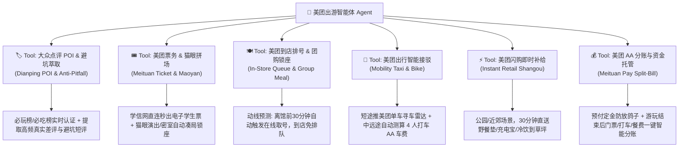
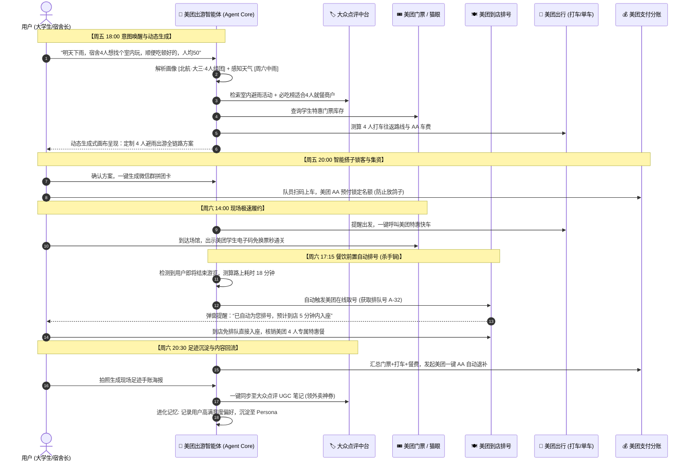

# 「周末去哪玩」× 美团生态 AI Agent 整合战略与产品总纲
> 美团 Vibe Coding / 高阶产品设计与面试终极答辩方案  
> 版本：V2.0.0 (Agent-Native & Ecosystem Edition)  
> 核心框架：美团“零售+科技”底座 × 俞军交易模型 × 现代 AI Agent（ReAct + Generative UI）架构

---

## 目录
1. [顶层定调：为什么这道面试题必须做成「美团生态 AI Agent」？](#一顶层定调为什么这道面试题必须做成美团生态-ai-agent)
2. [用户画像与端侧个性化算法机制（Local Persona & Context Engine）](#二用户画像与端侧个性化算法机制local-persona--context-engine)
3. [美团 × 大众点评 六大基础设施能力与 Agent 工具库（Tool Suite）](#三美团--大众点评-六大基础设施能力与-agent-工具库tool-suite)
4. [Agent 核心编排工作流与时空协同架构（ReAct Workflow）](#四agent-核心编排工作流与时空协同架构react-workflow)
5. [交互形态全面重构：Generative UI（动态生成式出游画布）](#五交互形态全面重构generative-ui动态生成式出游画布)
6. [商业闭环与经济学模型算账（俞军公式与美团商业价值）](#六商业闭环与经济学模型算账俞军公式与美团商业价值)
7. [面试答辩现场表达框架（45秒开场 + 专家级问答对策）](#七面试答辩现场表达框架45秒开场--专家级问答对策)

---

## 一、顶层定调：为什么这道面试题必须做成「美团生态 AI Agent」？

### 1.1 面试官的考核意图分层

在美团针对这道题的考评体系中，不同层级的候选人交付的成果存在本质差异：

| 层次 | 方案形态 | 面试官的核心评价 |
| :--- | :--- | :--- |
| **初阶 (L4/普通)** | 做一个类似“小红书/马蜂窝”的静态攻略 App，展示固定的卡片与假数据 | 典型“重复造轮子”，脱离美团业务，没有任何商业壁垒与履约能力 |
| **中阶 (L5/资深)** | 把门票、打车、团购等美团业务写进静态详情页（功能拼凑） | 有业务敏锐度，但属于 Web 2.0 时代的存量拼接，缺乏创新深度 |
| **高阶 (L6/顶尖)** | **重构为「美团本地生活 AI Agent」**：以端侧用户画像为基座，结合动态时空环境，由 Agent 自主规划并调用美团六大基础设施完成**一站式规划与履约闭环** | **具备前沿 AI 架构视野 + 顶级商业嗅觉 + 降维打击的落地能力** |

### 1.2 为什么传统 App 解决不了？为什么通用 ChatGPT 也会失败？

* **传统 App（美团/点评现状）的死穴：决策成本极高**  
  用户面对的是上百个业务频道和浩瀚的 POI 列表。周五晚上想出去透气，要在点评刷 40 分钟攻略、去美团看门票、去高德查交通、打电话问餐厅排不排队，**“搜索驱动（Search-Driven）”带来了极其严重的决策疲劳**。
* **通用大模型（ChatGPT / 传统 Travel Agent）的死穴：物理世界悬空与严重幻觉**  
  通用的 AI 攻略看似头头是道，但它**无法感知物理世界的实时状态**（不知道展馆周一闭馆、不知道下午 5 点餐厅排队 120 桌、不知道外面正在下雨），更**无法替用户买票、取号、叫车**。用户拿了 AI 攻略，还得自己去美团手动操作一遍。
* **破局唯一解：美团生态下的本地生活智能体（Local Life Agent）**  
  美团拥有全中国最强、最全的本地实时履约网络。**“Agent 意图规划 + 美团实时物理世界 API”**，是全世界唯一能够实现**「规划即履约（Planning is Execution）」**的终极形态。

---

## 二、用户画像与端侧个性化算法机制（Local Persona & Context Engine）

本产品坚决摒弃“全员推送一模一样的 3 套静态方案”，而是基于面向用户的**端侧偏好引擎 + 意图推演算法**，实现真正的千人千面。

```
┌────────────────────────────────────────────────────────────────────────┐
│ 1. 用户数字孪生画像 (Local Persona & Identity)                        │
│    · 身份基座: [高校学生认证 (学信网/校园卡打通)] → 激活学生票/拼团特惠  │
│    · 社交属性: [同寝室4人组团 / 极简独行放空 / 寻找同校搭子 / 双人约会] │
│    · 消费层级: [极限穷游 (人均≤30) / 性价比 (人均30-60) / 品质休闲]     │
│    · 动态偏好: [历史拒绝重度排队 / 喜欢打卡出片 / 密室推理重度爱好者]     │
└──────────────────────────────────┬─────────────────────────────────────┘
                                   │
                                   ▼
┌────────────────────────────────────────────────────────────────────────┐
│ 2. 实时情境与环境感知 (Context Sensing Engine)                        │
│    · 天气传感器: 周六 14:00 局部降雨 (气温 15℃) → 触发【室内避雨策略】  │
│    · 空间基准点: 海淀学院路校区 → 建议活动半径 ≤ 10km (控制往返时间)    │
│    · 时间可用度: 周六 13:30 - 20:30 (半日轻量出行)                      │
└──────────────────────────────────┬─────────────────────────────────────┘
                                   │
                                   ▼
┌────────────────────────────────────────────────────────────────────────┐
│ 3. Agent 动态约束求解与推荐算法 (Constraint Satisfaction & Matching)   │
│    · 目标函数: Max(出游体验评分, 社交契合度) - Min(总开销, 交通摩擦)   │
│    · 严苛过滤: 剔除室外露天景区；排除人均 > 60 元项目；锁定免预约/快出票│
│    · 时空编排: 步行/单车接驳最短路径规划 + 晚餐就近排号动态预测         │
└────────────────────────────────────────────────────────────────────────┘
```

### 2.1 用户画像的核心维度设计
1. **身份特权层**：美团校园认证（专享景区学生半价、到店专属学生折上折）。
2. **出行心智与风格分类**：
   * **「高能探索型」**：偏好密室逃脱、剧本杀、室内攀岩、Livehouse 演出；
   * **「文艺出片型」**：偏好当代艺术展、小众文创市集、景观咖啡馆；
   * **「松弛放空型」**：偏好城市漫步（Citywalk）、近郊露营、静谧书店；
   * **「美食品鉴型」**：以大众点评必吃榜/老字号为核心锚点反向规划行程。
3. **记忆自进化（Agent Memory）**：
   * Agent 记录每一次出游反馈（例如：“上次打卡嫌步行太远”、“偏好免排队餐厅”），在下一次规划时自动提升打车或提前取号的优先级。

---

## 三、美团 × 大众点评 六大基础设施能力与 Agent 工具库（Tool Suite）

Agent 之所以具备超能力，是因为其底层封装了美团与大众点评的 6 大生产级 API，由 Agent 在规划过程中自主调用：



### 3.1 核心工具深度解析

#### ① 大众点评：从“人工找攻略”到“算法自动避坑”
* **传统痛点**：攻略软文漫天，照骗泛滥，人工筛选耗费数小时。
* **Agent 赋能**：Agent 调用点评 API，仅采纳「近 30 天真实消费用户评价」和「必玩榜/必吃榜」认证数据；通过 NLP 算法自动萃取**“一句话避坑短评”**（如：“⚠️ 16:30 停止入场，展馆二层灯光偏暗需自带补光”）。

#### ② 美团到店餐饮：全网唯一的杀手锏——「动线时序智能自动排号」💡
* **传统痛点**：周末热门餐厅动辄排队 1-2 小时，严重破坏出游心情。
* **Agent 赋能**：**时空动线协同**。Agent 根据前序活动（如看展）的预计离场时间（17:30）与到店交通耗时（20分钟），**于 17:15 自动触发美团在线远程排号**！当用户步入餐厅时，刚好叫到号直接入座，将等待时间压缩至接近 0。

#### ③ 美团出行：单车与打车全流程接驳
* **近距离（1-3km）**：自动拉取校门/地铁口美团单车实时可用车况，规划最佳骑行绿道；
* **中远途（>5km）**：自动核算“美团特惠快车”总价与**“4人拼团 AA 人均价”**（例如：“全程打车 ¥36，宿舍 4 人 AA 后仅 ¥9/人，比挤地铁还省 25 分钟”），消除出行决策摩擦。

#### ④ 美团票务 & 猫眼娱乐：一键秒级核验
* 学生身份自动免密绑核，告别现场换票排长队，手机出示美团聚合电子码直接刷闸入园；猫眼演出支持“3 缺 1 在线拼场”，快速锁定席位。

#### ⑤ 美团支付：AA 自动分账与防放鸽子闭环
* 过去拼团最怕“有人临时放鸽子”或“活动结束后尴尬算账”。Agent 引入美团 AA 集资，成团预付小额意向金，活动结束后一键汇总门票+打车+餐费生成清晰账单，美团钱包秒级分摊多退少补。

---

## 四、Agent 核心编排工作流与时空协同架构（ReAct Workflow）

一次完整的周末出游，由 Agent 按照时序自主完成感知、编排、执行与沉淀：



---

## 五、交互形态全面重构：Generative UI（动态生成式出游画布）

彻底告别传统的“静态多级页面点击跳转”，重构为现代 Agent 标杆性的 **Generative UI（生成式动态画布）** 架构。

### 5.1 界面布局架构（全屏自适应动态面板）

```
┌────────────────────────────────────────────────────────────────────────┐
│ 🤖 美团周末出游智能体 (Weekend Explorer Agent)                         │
├────────────────────────────────────────────────────────────────────────┤
│ 👤【当前画像】🎓 北航·大三工科 | 👥 4人宿舍同游 | 💰 预算上限 ¥50/人     │
│ ⛅【实时环境】📍 学院路校区 | 🌧️ 周六中雨 (16℃) · 自动避开露天景区       │
├────────────────────────────────────────────────────────────────────────┤
│ 💬【Agent 意图微调控制台 (Natural Language Input)】                     │
│  "帮我们安排周六下午的室内路线，想要烧脑一点的，晚餐吃铜锅肉"          │
│  [✨ 快捷调整: 换一家免排队的] [把预算压低至¥35] [改为双人约会模式]     │
├────────────────────────────────────────────────────────────────────────┤
│ 🎨【动态生成式出游履约画布 (Dynamic Generative Canvas)】               │
│                                                                        │
│  ┌─ 13:45 🚗【美团打车 · 特惠快车】─────────────────────────────────┐   │
│  │ 动线: 北航南门 → 798 室内沉浸推理馆 (12.4km / 22分钟)            │   │
│  │ 费用: 预估 ¥36 · 宿舍4人 AA 后人均仅 ¥9 (免去雨天转乘地铁)       │   │
│  │ [ 状态: Agent 已规划最佳出发时机 ]                               │   │
│  └──────────────────────────────────────────────────────────────────┘   │
│                                                                        │
│  ┌─ 14:30 🎭【猫眼/休娱 · 沉浸式机械密室】─────────────────────────┐   │
│  │ 认证: 大众点评 · 2026北京密室必玩榜 | ⭐ 4.9分 (1842条好评)       │   │
│  │ 避坑: ⚠️ "前人反馈：内部机关需解密，建议提前15分钟到场听规则"    │   │
│  │ 门票: 学生特惠 ¥32/人 (已自动调用学信网认证减免 ¥28)             │   │
│  │ [ 状态: 电子学生码已就绪 · 免现场换票 ]                         │   │
│  └──────────────────────────────────────────────────────────────────┘   │
│                                                                        │
│  ┌─ 17:15 ⏰【美团在线排号 · 智能守护】────────────────────────────┐   │
│  │ 目标: 聚宝源铜锅涮肉 (必吃榜商户，距展馆 600m)                   │   │
│  │ 调度: 预计此时出馆，Agent 将自动远程取号 A-28                    │   │
│  │ 承诺: 抵达时排队不超过 5 分钟即可叫号就座                        │   │
│  └──────────────────────────────────────────────────────────────────┘   │
│                                                                        │
│  ┌─ 18:00 🍲【美团到店 · 4人特惠团购套餐】─────────────────────────┐   │
│  │ 菜品: 4人老北京铜锅超值套餐 (原价 ¥288，学生专享 ¥148)           │   │
│  │ 费用: 4人 AA 后每人仅需 ¥37                                     │   │
│  └──────────────────────────────────────────────────────────────────┘   │
│                                                                        │
│ ┌─ 📊 全程费用智能清算面板 ──────────────────────────────────────────┐   │
│ │ 门票 ¥32 + 打车往返 ¥18 + 餐饮 ¥37 = 人均 ¥87 (符合预算设定)       │   │
│ └────────────────────────────────────────────────────────────────────┘   │
├────────────────────────────────────────────────────────────────────────┤
│ [ 📤 一键生成搭子拼团微信卡片 ]    [ ⚡ 授权 Agent 一键托管排号与锁票 ] │
└────────────────────────────────────────────────────────────────────────┘
```

### 5.2 现场与履约后：双向数据资产回流
1. **P05 现场足迹打卡**：现场拍摄照片，Canvas 动态叠加带美团点评背书的“天气、地点、日期、出游编号”防伪印章。
2. **一键同步大众点评笔记**：一键生成大众点评探店笔记，沉淀真实评价，用户领取美团神券，形成内容供给飞轮。
3. **P06 实时智能账单清算**：活动结束自动生成美团消费图谱，多退少补一键分账。

---

## 六、商业闭环与经济学模型算账（俞军公式与美团商业价值）

### 6.1 俞军用户价值公式严格推演

$$\text{用户价值} = \text{新体验} - \text{旧体验} - \text{替换成本}$$

| 维度 | 传统工具方案 (纯前端写死展示) | **美团生态 AI Agent 方案 (本方案)** |
| :--- | :--- | :--- |
| **旧体验分析** | 小红书刷 40 分钟（内容佳但无交易，75分）；微信约人易流产（80分） | 用户面对海量信息与繁琐排号，出游总合力体验仅 60 分 |
| **新体验得分** | **35 分**（只看几个固定卡片，还要自己去买票叫车排队） | **95 分**（自然语言秒级生成专属方案，动线无缝衔接，自动排号免等待，全链路履约） |
| **替换成本** | **85 分**（需离开微信去使用一个无任何公信力的小平台） | **25 分**（基于美团与点评成熟基座，学生认证免密，信任度极高） |
| **用户价值结果** | $35 - 75 - 85 = \mathbf{-125 < 0}$（**必死**） | $95 - 60 - 25 = \mathbf{+10 > 0}$（**极强正向收益，必然爆发**） |

### 6.2 美团平台的核心战略收益（为什么美团愿意全力推这个产品？）

1. **场景化交叉销售率（Cross-Selling Ratio）激增**：
   以往美团各业务是孤岛。通过出游场景智能编排，一次出游**同时驱动门票、打车、单车、到店餐饮、闪购 5 个业务线**，大幅提升单个年轻用户的客单价与 LTV。
2. **重塑年轻一代的内容心智（从搜索到发现）**：
   不与小红书硬拼长篇大论的“精致美文”，而是用**“轻量情境决策 + 极致物理履约”**构建不可替代的差异化护城河——“小红书给你造梦，美团 Agent 帮你落地”。
3. **高校高潜用户的零成本自然裂变**：
   借助“同校搭子拼团 + 拼神券 + 拼打车”，学生自发在班级群与朋友圈转发裂变，用极低的补贴获取高净值年轻生力军。

---

## 七、面试答辩现场表达框架（45秒开场 + 专家级问答对策）

### 7.1 黄金 45 秒开场白（建立绝对的专业壁垒）

> “各位老师好！对于‘周末城市出游’这道题，我的核心思考是：**孤立地做一个攻略工具在商业上是无法成立的**。
> 用户在小红书看攻略、在微信约人，最后还要自己去各平台买票、排队、打车，执行成本极高。
> 因此，我将产品定位为**「美团本地生活出游 AI Agent」**。
> 它的核心逻辑是：**以端侧用户画像和实时天气为输入，通过 Agent 的自主编排，调度美团与大众点评六大基础设施 API——包括点评真实避坑短评、美团门票极速出票、以及全网唯一的‘离场前自动排号’和打车 AA 算账**。
> 它让用户从原本耗时 40 分钟的多平台辗转，变成 3 分钟内完成‘意图规划到一键履约’的全链路闭环。这才是美团在本地生活领域面对小红书和高德时，真正坚不可摧的护城河。”

### 7.2 面试官深度追问与防御性反击话术（Q&A）

#### 追问 1：“高德也在做顺路搜和出行规划，美团做这个的壁垒在哪里？”
* **反击点**：**高德拥有地理路网，但美团掌控「到店消费与履约控制权」。**
  高德可以告诉你哪条路不堵车，但高德无法做到在你从展馆出来前 30 分钟**自动取号聚宝源铜锅涮肉**，高德也没有**大众点评 20 年积累的必吃榜和真实 UGC 避坑数据**。出游的核心目的是“消费与体验”，交通只是中间态，美团抓住了最核心的消费终局。

#### 追问 2：“既然是大模型 Agent，如何解决大模型的幻觉问题？推荐的店铺倒闭了怎么办？”
* **反击点**：**Agent 负责‘意图理解与时空编排逻辑’，美团的生产级 API 负责‘事实与数据约束’。**
  我们绝不让 LLM 自由捏造 POI。Agent 在生成行程时，必须通过 Tool Calling 调用大众点评实时 POI 数据库与美团商户在营业状态接口。有库存、在营业、评分达标才会被采纳进候选集，从底层架构上根除幻觉。

#### 追问 3：“为什么不采用最直接的白底聊天窗口（Chatbot），而要做成动态画布（Generative UI）？”
* **反击点**：**出游决策具有强烈的‘时间轴’和‘空间动线’属性，纯文字对话是极其低效的信息载体。**
  用户需要一眼看到几点去哪里、花多少钱、排队进度如何。Generative UI 让 Agent 能够根据推理结果实时渲染出结构化的时间轴卡片与一键履约按钮，兼具自然语言交互的灵活性与专业图形界面的确定感。

---

*总纲归档时间: 2026-09-30 | 版本: V2.0.0 (Agent-Native & Ecosystem Edition) | 编制：产品专家组*
