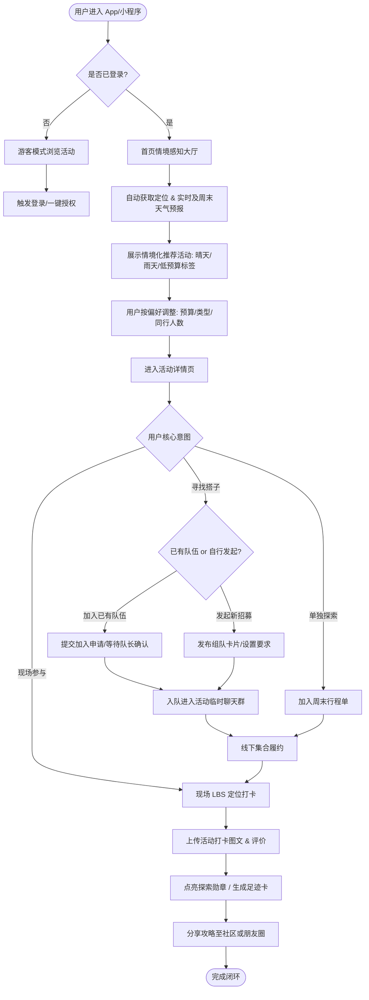
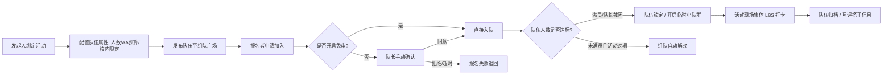
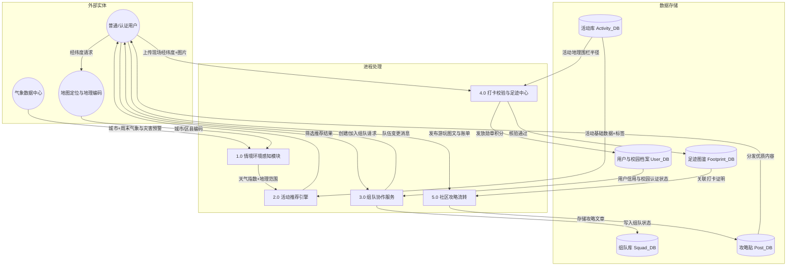
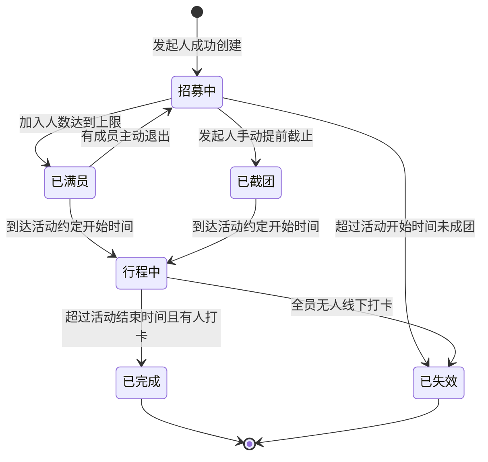
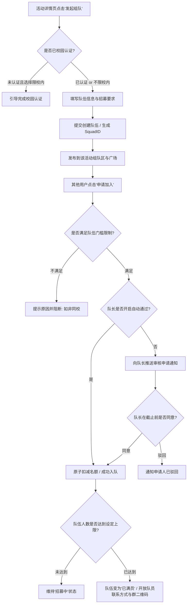
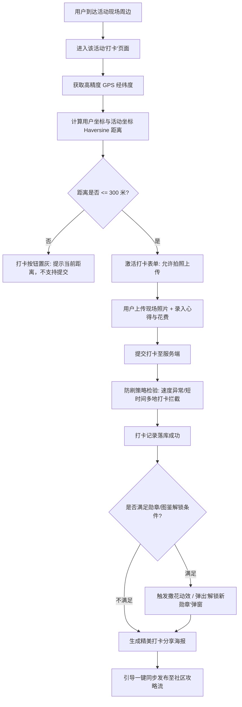
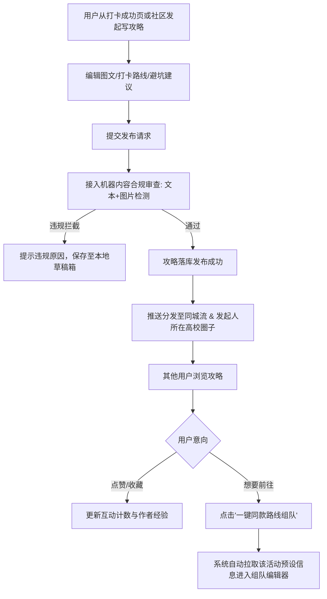
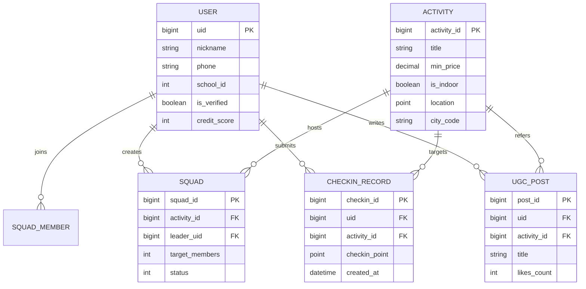

# 「周末去哪玩」—— 周末城市探索指南 产品需求文档（PRD）

版本号：V1.0.0

| 版本 | 时间 | 修订人 | 备注 |
| :--- | :--- | :--- | :--- |
| V1.0.0 | 2026/09/29 | 产品团队 | 基于大学生周末出行痛点完成初始评审版本编制 |

---

## 一、概述（为什么做）

### 1.1 产品概述及目标

#### 1.1.1 背景介绍
当前大学生群体在周末及节假日拥有充足的闲暇时间，但在日常出游决策上面临显著痛点：
1. **活动信息高度分散**：美术馆展览、小众市集、Livehouse演出、近郊轻徒步等活动分布在大众点评、小红书、大麦、秀动及本地各类公众号中，搜寻与比价成本极高；
2. **多重决策因子强约束**：
   - **天气敏感**：户外徒步、露营受降雨、大风、高温严重制约，突发天气常导致计划泡汤；
   - **预算刚性**：大学生支配收入受限，对价格敏感度高，强烈关注门票学生优惠、免预约及人均消费（通常单次预算在 30 ~ 150 元）；
   - **社交与同行不确定**：宿舍同圈层喜好不同，常陷入“想去没人陪、找搭子难、自建微信群容易鸽”的困境；
3. **决策链路与履约割裂**：现有内容平台重“种草”轻“履约”，缺乏将“天气-预算-选址-组队-打卡-沉淀足迹”串联的闭环工具。

#### 1.1.2 产品概述
「周末去哪玩」（周末城市探索指南）是一款面向大学生的**情境感知型（Context-Aware）本地活动探索与社交协作产品**。产品根据用户实时地理位置、当前与周末天气预报、单人/团队预算以及兴趣偏好，动态推荐最适合的本周末精选活动；同时提供同校/同城搭子组队、现场 LBS 打卡记录与图鉴勋章、低门槛避坑攻略分享，帮助大学生告别周末纠结，轻松结伴探索城市。

#### 1.1.3 产品目标

**业务目标**

| 目标 | 衡量指标 | 目标值 | 达成周期 |
| :--- | :--- | :--- | :--- |
| 核心用户激活与转化 | 推荐卡片详情点击率 (CTR) | ≥ 25% | 上线后 2 个月 |
| 履约与社交闭环 | 组队发起成功率（成团率） | ≥ 40% | 上线后 3 个月 |
| 用户留存表现 | 30 天次周周末回访留存率 (W1) | ≥ 35% | 上线后 3 个月 |
| 内容冷启动 | 周均打卡记录生成量 (UGC) | ≥ 3,000 条 / 试点城市 | 上线后 3 个月 |

**用户目标**

| 目标用户 | 用户目标 | 衡量指标 |
| :--- | :--- | :--- |
| 纠结型出游者 | 3分钟内根据个人预算与当周天气匹配到满意行程 | 首页筛选到确定目的地的平均时长 < 180s |
| 社交搭子需求者 | 快速找到同校或同好搭子，降低出行社交门槛与被鸽率 | 组队招募从发布到满员平均耗时 < 24h |
| 城市打卡玩家 | 沉淀个人专属的大学城市探索印记与成就图鉴 | 单用户月均打卡活动数 ≥ 2.5 次 |

#### 1.1.4 目标用户

| 角色 | 用户特征与画像 | 核心诉求 |
| :--- | :--- | :--- |
| 探索型大学生 | 活跃、喜欢拍照打卡、探店、逛展、参加市集，具备一定审美要求 | 发现小众低成本好去处，沉淀足迹与优质攻略 |
| 随缘宅家大学生 | 想出门但懒得做繁琐攻略，受限于天气和交通便利度 | 智能直接给方案（“雨天室内方案”、“50元玩一天”） |
| 社交孤岛大学生 | 身边朋友周末时间不合拍，喜欢徒步/桌游/骑行但缺队友 | 真实安全（同校优先）的组队搭子网络，AA透明 |
| 运营管理员 | 平台运营人员，负责活动审核、抓取源校验、风控违规处理 | 高效管理活动库、监控低俗违规组队与虚假攻略 |

### 1.2 名词说明

| 名词 | 英文 / 缩写 | 说明 |
| :--- | :--- | :--- |
| 情境感知推荐 | Context-Aware Rec | 结合客户端实时获取的天气状况、气温、地理位置、用户预设预算区间的动态推荐算法 |
| 活动搭子 | Activity Squad | 针对某个特定周末活动发起的临时同游小队（通常为 2~6 人） |
| LBS 打卡 | LBS Check-in | 用户到达活动指定地点方圆指定距离（如 300m）触发的地理围栏核验打卡 |
| 校园认证 | Campus Auth | 通过 `.edu.cn` 教育邮箱或学信网验证码完成的在校大学生身份认证 |
| 探索图鉴 | Exploration Badge | 基于地理区域或特定主题（如“咖啡市集达人”、“夜游徒步家”）累积的数字徽章与里程碑体系 |

### 1.3 角色及权限

| 角色 | 权限范围 | 数据范围 |
| :--- | :--- | :--- |
| 游客用户 | 浏览热门推荐、查看活动详情、查看公开攻略 | 仅可查看公开活动与攻略，不可发起组队、报名或打卡 |
| 登录普通用户 | 完整推荐使用、个性化筛选、收藏、评论、现场打卡、发布攻略 | 本人操作数据及公开社交数据 |
| 校园认证用户 | 享有普通用户全部权限，支持发起/加入“仅限在校生”组队，享有学生专属折扣标志 | 本人数据及同校圈层互动数据，享有官方学生权益 |
| 社区内容管理员 | 审核活动内容、组队违规举报处理、攻略加精/置顶、违规封禁 | 运营后台所有业务数据及审计日志 |
| 超级管理员 | 具备系统级配置权限、模型权重参数调整、系统字典配置、角色授权 | 全平台所有数据与系统配置 |

### 1.4 文档阅读对象

| 对象 | 关注重点 |
| :--- | :--- |
| 前端研发 (Web/小程序/App) | 界面交互状态、表单验证规则、LBS定位逻辑、即时通讯协同 |
| 后端研发 | 推荐过滤引擎、组队高并发抢占、天气 API 对接、状态流转与数据字典 |
| UI/UX 设计师 | 情境氛围切换（晴雨视觉反馈）、打卡图鉴视觉质感、搭子组队卡片层次 |
| 测试工程师 (QA) | 异常网络/定位降级、组队满额并发测试、极端天气过滤边界、权限互斥校验 |
| 运营与数据分析 | 推荐转化漏斗、留存埋点口径、活动生命周期审核规则 |

---

## 二、产品描述（做什么）

### 2.1 产品需求描述
本期（V1.0.0 MVP）主要构建以下核心业务能力：
1. **智能活动探索引擎**：支持按城市、天气联动（自动降权雨雪天户外项目，置顶室内文化展演）、预算区间（0元免费、50元内、100元内等）、同行规模与出行标签进行组合检索；
2. **同校/同城搭子组队**：支持活动一键发起搭子招募，包含人数限制、AA费用预算、同校标签过滤、报名审核、队伍小群沟通；
3. **足迹现场打卡与探索图鉴**：基于 GPS 地理围栏校验的活动打卡，支持图文心情记录、消费记账标签，自动点亮城市探索勋章；
4. **轻量攻略与避坑分享**：以卡片化发布真实出行攻略，支持“一键同款路线”、校园热门活动榜单。

**明确不做（V1.0.0 边界排除）**：
- 暂不自建票务交易闭环与退改签系统（活动票务采用跳转外部官方渠道或纯线下购买引导）；
- 暂不引入复杂的陌生人商业相亲/婚恋属性功能；
- 暂不开放全开放式的无门槛外部广告投放。

### 2.2 产品整体流程

#### 2.2.1 主业务流程



#### 2.2.2 组队与履约子流程



#### 2.2.3 数据流图 (DFD)



#### 2.2.4 关键实体状态转换图 (STD)

**组队房间状态变迁：**


### 2.3 全局说明

#### 2.3.1 全局异常处理

| 异常场景 | 触发条件 | 处理机制 | 用户提示文案 |
| :--- | :--- | :--- | :--- |
| 定位权限被拒 | 用户首次拒绝或系统关闭位置权限 | 阻断自动定位，降级弹出城市手动切换浮层，默认定位为“同城大学聚集区” | “未能获取您的位置，请手动选择所在城市/高校园区” |
| 突发极端天气 | 气象 API 返回红色/橙色暴雨、大风、雷暴预警 | 强提示弹窗拦截，并在所有户外活动详情页标注醒目风险警示角标，禁止发起户外组队 | “气象局已发布[天气类型]预警，建议优先选择室内安全活动” |
| 组队并发争抢 | 多人同时抢占最后一个入队名额 | 依赖 Redis 分布式锁与 Lua 脚本原子计数，抢占失败者进入排队等待队列 | “慢了一步，该队伍刚刚满员啦~” |
| LBS 打卡防作弊 | 客户端经纬度与目标围栏超出 300m，或检测到虚拟定位 (Mock Location) | 打卡提交校验失败，记录一次风险日志，打卡按钮维持置灰状态 | “距离活动现场过远（>300m）或定位异常，请到达现场后重试” |
| 服务端网络不可用 | 接口超时 (>5s) 或网关 502/504 | 启用本地数据缓存兜底（首页展示最近一次离线缓存的活动流） | “网络开小差了，正在查看离线精彩推荐” |

#### 2.3.2 列表规则

| 规则项 | 详细规则说明 |
| :--- | :--- |
| 分页加载 | 列表统一采用 Waterfall（瀑布流）分页，默认每页 20 条，距底部 300px 预加载下一页 |
| 默认排序 | 首页推荐流算法：`Score = 0.4*情境契合度(天气+预算) + 0.3*距离倒数 + 0.2*热度/组队中 + 0.1*校园圈专属加权` |
| 列表空态 | 满足筛选条件但无结果时，提示“该条件下暂无活动，已为您放宽距离或预算限制”，并展示降级兜底活动 |
| 刷新机制 | 页面支持下拉刷新（Pull-to-refresh），强制触发重新拉取天气预报与即时状态 |

#### 2.3.3 全局交互

| 场景 | 交互表现 |
| :--- | :--- |
| 操作成功 | 屏幕正中微动效 Toast 提示（附带成功图标），展示 1.5 秒后平滑淡出 |
| 操作失败 | 屏幕顶部下滑危险提示条（红色渐变），提供具体原因说明 |
| 敏感操作确认 | 退出队伍、取消已发布组队、删除自建攻略均须弹出双按钮 Modal，附带次要行为二次确认 |
| 页面骨架屏 | 弱网加载阶段展示 Shimmer 骨架占位卡片，避免空白跳动 |

### 2.4 产品版本规划（里程碑）

| 版本号 | 阶段定位 | 核心范围 | 交付周期 [假设] | 验收目标 |
| :--- | :--- | :--- | :--- | :--- |
| **V1.0.0** | MVP 验证期 | 天气/预算/兴趣推荐引擎、基础组队大厅、LBS拍照打卡、轻量发布图文攻略、校园认证体系 | 4 周 | 跑通核心端到端流程，在 1-2 所试点高校获取首批 1000 名核心用户 |
| **V1.1.0** | 社交与内容强化 | 队伍临时群聊（即时通讯支持）、队伍账单 AA 结算小工具、打卡成就徽章体系、小红书式瀑布流 | 3 周 | 组队成团率达 40%，次周留存提升至 35% |
| **V1.2.0** | 供给侧与生态拓展 | 官方主办方认证接入、学生专属门票优惠直领/跳转、AI智能自动生成周末特种兵游玩路线 | 4 周 | 活动库丰富度达同城 500+，建立持续自治内容生态 |

### 2.5 产品框架与信息架构 (IA)

```
[周末去哪玩 App / 小程序]
│
├── 1. 探索大厅 (Home)
│   ├── 天气与情境看板 (今日/本周末天气、出行适宜指数、一键“室内避雨模式”)
│   ├── 快速过滤器 (预算区间滑块、人数模式[单人/搭子/宿舍寝室团]、出行分类)
│   ├── 主题精选展区 (0元羊毛展、小众市集、近郊深呼吸、落日飞车)
│   └── 探索推荐瀑布流 (动态卡片：活动封面、距离、学生特惠、进行中队伍数)
│
├── 2. 组队广场 (Squad)
│   ├── 组队大厅 (按同校认证、活动类别、出行时间筛选)
│   ├── 发起招募 (选择关联活动、招募人数、费用模式、入队门槛、集合要求)
│   └── 我的小队 (待成团、行程中、历史队伍、临时队伍聊天)
│
├── 3. 现场打卡与足迹 (Check-in & Footprint)
│   ├── LBS 电子围栏打卡核验
│   ├── 探索手账 (打卡照片水印生成、真实人均账单记录、避坑小建议)
│   └── 探索图鉴 (城市高校圈地图点亮、里程碑数字勋章墙)
│
├── 4. 社区攻略 (Community)
│   ├── 热门同城/校园生活圈 (学生亲测路线、黑榜避坑)
│   ├── 攻略发布器 (支持一键关联活动打卡凭据与坐标)
│   └── 详情互动 (点赞、收藏、“一键发起同款组队”)
│
└── 5. 个人中心 (My)
    ├── 个人主页与校园身份认证 (.edu / 学信网核验)
    ├── 我的收藏与周末行程规划单
    └── 搭子社交信用分与评价记录
```

### 2.6 功能清单 (Feature Matrix)

| 模块 | 功能项 | 优先级 | 版本 | 功能概述 |
| :--- | :--- | :--- | :--- | :--- |
| 环境感知推荐 | 天气动态适配 | P0 | V1.0 | 抓取周末降雨/温度数据，恶劣天气智能加权室内避险展演 |
| 环境感知推荐 | 预算滑块筛选 | P0 | V1.0 | 支持自定义 0~200+ 元滑块，提供“0元免费/学生特惠”快速勾选 |
| 环境感知推荐 | 活动卡片详情 | P0 | V1.0 | 包含地址、开放时间、交通指南、学生证优惠指引、官方出处 |
| 组队与搭子 | 发起组队 | P0 | V1.0 | 设定招募人数(2-8人)、集合时间、出行偏好、是否限同校学生 |
| 组队与搭子 | 申请/加入队伍 | P0 | V1.0 | 支持申请留言、队长一键通过或驳回、满额自动封团 |
| 组队与搭子 | 队伍成员列表与沟通 | P1 | V1.0 | 展示入队成员标签与校园认证，提供外部微信群二维码/临时展示 |
| 现场打卡 | LBS 地理围栏校验 | P0 | V1.0 | 校验经纬度距活动目标点 ≤ 300 米，防止虚假异地打卡 |
| 现场打卡 | 打卡生成足迹卡 | P0 | V1.0 | 拍照上传、附带时间/地点/天气水印、生成个人足迹海报 |
| 现场打卡 | 探索勋章体系 | P1 | V1.0 | 统计用户打卡频次与分类，自动解锁“文艺策展人”、“山野特种兵” |
| 攻略与社区 | 攻略发布 | P1 | V1.0 | 支持多图+富文本+消费明细，标注“实测避坑项” |
| 攻略与社区 | 攻略转组队 | P1 | V1.0 | 攻略详情页底栏提供“照着去-一键发起同款搭子”按钮 |
| 用户与认证 | 校园身份认证 | P0 | V1.0 | 支持教育邮箱或学生证人工审核，打上“同校认证”蓝标 |

---

## 三、功能需求（怎么做）

### 3.1 模块一：情境感知智能探索与推荐引擎

#### 3.1.1 描述
根据用户地理位置、天气预报（重点锁定当周六/日）以及学生预设的预算区间与同行偏好，智能过滤并分发活动。

#### 3.1.2 用户故事
- 作为一名**囊中羞涩的大学生**，我希望能**一键筛选 50 元以内甚至免门票的活动**，以便在不超支的情况下度过周末。
- 作为一名**讨厌下雨出行的大学生**，我希望**系统在下雨天自动推荐室内展览和桌游市集**，以便我不用临时调整行程。

#### 3.1.3 前置条件与后置条件
- **前置条件**：客户端成功获取 GPS 经纬度（或用户手动选中所在大学聚集区城），成功请求第三方气象服务。
- **后置条件**：本地缓存计算后的推荐列表，排序打分结果展示于首页。

#### 3.1.4 界面及交互规格

| 界面元素 | 控件类型 | 必填 | 默认值 | 校验与限制规则 | 交互与操作反馈 |
| :--- | :--- | :--- | :--- | :--- | :--- |
| 天气看板胶囊 | 自定义卡片 | 否 | 读取接口 | 展示气温、多云/雨晴图标、适宜度指数 | 点击弹出“本周末 48 小时天气详情与降水概率” |
| 预算区间滑块 | 双向滑动 Slider | 是 | 0 ~ 150 元 | 范围 0 ~ 500 元，步长 10 元，包含“仅看免费”复选框 | 滑动时推荐流实时联动更新，松手后重新拉取打分排序 |
| 同行人数选择 | 单选 Tab 按钮 | 是 | “找搭子(2-4人)” | 选项：独处(1人)、搭子(2-4人)、宿舍轰趴(5+人) | 切换后动态过滤活动承载属性标签 |
| 活动分类筛选 | 横向滑动 Tag | 否 | 全部 | 展览/市集/音乐Live/轻户外/文创探店 | 高亮选中标签，支持多选，点击即时触发筛选项刷新 |

#### 3.1.5 业务流程图

```mermaid
flowchart TD
    A[用户打开首页] --> B[读取经纬度与目标周末日期]
    B --> C[调用天气服务获取天气状态]
    C --> D{周末是否降水或极端气象?}
    D -->|是 (降水/极端)| E[触发室内保障模型: 户外活动权重大幅下调]
    D -->|否 (晴朗/多云)| F[正常全量召回模型]
    E --> G[根据预算滑块筛选: Price <= MaxBudget]
    F --> G
    G --> H[根据同行模式筛选匹配属性]
    H --> I[排序算法加权: 距离 + 校园热度 + 学生优惠标]
    I --> J[渲染首页推荐列表卡片]
```

#### 3.1.6 异常与分支流程

| 异常场景 | 触发条件 | 处理机制 | 界面提示文案 |
| :--- | :--- | :--- | :--- |
| 气象接口宕机 | 天气供应商服务超时（>3s）或返回异常 | 兜底使用常规模拟气象或上次有效缓存，降权天气过滤逻辑 | 顶部弱提示：“天气数据更新延迟，暂按常态为您推荐” |
| 超低预算无召回 | 设定预算为 0 元且选择了小众演出分类 | 自动放宽预算至最低有票档次，并给出说明 | “当前分类暂无免费活动，已为您找到最低票价 20 元的相近活动” |

#### 3.1.7 数据字典

| 字段名 | 类型 | 必填 | 约束与说明 | 示例值 |
| :--- | :--- | :--- | :--- | :--- |
| `activity_id` | BigInt | 是 | 唯一主键 | 1002938472 |
| `title` | Varchar(100) | 是 | 活动名称 | “798艺术区·青年当代插画市集” |
| `category` | Enum | 是 | 1-展览, 2-市集, 3-演出, 4-户外, 5-聚会 | 2 |
| `min_price` | Decimal(10,2) | 是 | 最低价格（0代表免费） | 0.00 |
| `student_discount`| Boolean | 是 | 是否有学生优惠 | true |
| `is_indoor` | Boolean | 是 | 是否室内场地（用于天气联动） | true |
| `geo_point` | Point/GIS | 是 | 活动现场经纬度坐标 | [116.495, 39.984] |
| `weather_suitability`| Json | 否 | 适用气象环境描述 | `{"rain_friendly": true}` |

---

### 3.2 模块二：活动组队与搭子招募系统

#### 3.2.1 描述
支持在校大学生针对具体活动发起组队或加入他人小队，提供人数控制、同校过滤、入队审核及成团协同。

#### 3.2.2 用户故事
- 作为一名**想看展但室友不想去的大学生**，我希望能**在活动下发起一个限本校同学参加的 2 人搭子小队**，以便找到有安全感且兴趣一致的伙伴同行。
- 作为一名**周末想爬山的独行者**，我希望能**申请加入一个已有 3 人的徒步队伍**，以便分摊打车费用并不用独自面对户外安全问题。

#### 3.2.3 前置条件与后置条件
- **前置条件**：用户已登录且完成手机号绑定；如勾选“仅限在校生”，发起人与申请人均须通过校园认证。
- **后置条件**：队伍生成专属记录，报名成功扣减名额，触发通知提醒。

#### 3.2.4 界面及交互规格

| 界面元素 | 控件类型 | 必填 | 默认值 | 校验与限制规则 | 交互与操作反馈 |
| :--- | :--- | :--- | :--- | :--- | :--- |
| 目标招募人数 | 步进器 Stepper | 是 | 2 人 | 范围 2 ~ 10 人整数 | 点击“+ / -”动态变动，超限置灰 |
| 预算承担模式 | 下拉选择单选 | 是 | “各自AA” | 选项：各自AA / 发起人请客 / 免费结伴 | 切换选项时展示下方费用详细说明提示 |
| 仅限本校学生 | Switch 开关 | 是 | 默认开启 [假设] | 开启时发起人必须已完成校园认证，否则弹窗阻断并引导认证 | 切换时文案提示“开启后仅同校认证同学可申请” |
| 招募说明宣言 | 文本输入域 | 是 | 无 | 10 ~ 150 字符，敏感词过滤 | 输入字数实时计数，字数不足或违禁词红色报错 |
| 队长微信号/二维码 | 文本/图片上传 | 是 | 空 | 仅在成团通过后对队员可见，入队前脱敏保护 | 上传后展示图片缩略图，支持删除更换 |

#### 3.2.5 业务流程图



#### 3.2.6 异常与分支流程

| 异常场景 | 触发条件 | 处理机制 | 界面提示文案 |
| :--- | :--- | :--- | :--- |
| 成员临时退出 | 满员后活动开始前 4 小时以上退出 | 释放名额，队伍状态由“已满员”回滚至“招募中”，通知队长 | “有成员退出了队伍，名额已自动重新开放招募” |
| 恶意跳车（鸽子） | 距离集合时间不足 4 小时退出或无故缺席 | 扣除个人社交信用分 5 分，限制 7 天内不可发起新组队 | “临近出发退队已记录违约，影响未来组队信用” |
| 队伍超时未成团 | 活动开始时刻队伍人数仍 < 2 人 | 系统自动流转为“已失效”，解散队伍并向发起人推送提醒 | “很遗憾，该队伍在活动开始前未能招募成团” |

#### 3.2.7 数据字典

| 字段名 | 类型 | 必填 | 约束与说明 | 示例值 |
| :--- | :--- | :--- | :--- | :--- |
| `squad_id` | BigInt | 是 | 队伍唯一标识 | 8001928371 |
| `activity_id` | BigInt | 是 | 关联活动 ID | 1002938472 |
| `leader_uid` | BigInt | 是 | 发起人用户 ID | 5001293 |
| `target_members` | TinyInt | 是 | 目标总人数 (2-10) | 4 |
| `current_members`| TinyInt | 是 | 当前已入队人数 | 3 |
| `school_restricted`| Boolean| 是 | 是否仅限同校 | true |
| `school_code` | Varchar(30)| 否 | 所属高校标识（限校时必填） | “PKU_10001” |
| `cost_type` | Enum | 是 | 1-AA, 2-发起人请客, 3-免门票纯玩 | 1 |
| `status` | Enum | 是 | 0-招募中, 1-已满员, 2-行程中, 3-已完成, 4-已失效 | 0 |
| `contact_qr` | Varchar(255)| 是 | 队长微信联系方式/群码图片 OSS 链接 | `https://oss.../qr.jpg` |

---

### 3.3 模块三：现场 LBS 打卡与探索图鉴系统

#### 3.3.1 描述
用户到达活动目的地现场后，利用手机定位完成地理围栏打卡，记录现场照片、随笔和真实花费，点亮城市区域探索图鉴及数字徽章。

#### 3.3.2 用户故事
- 作为一名**喜欢记录大学生活的学生**，我希望能**在活动现场打卡并生成带有地点和天气水印的照片**，以便发小红书或朋友圈沉淀回忆。
- 作为一名**探店达人**，我希望能**收集不同区域的探索勋章**，以便在个人主页展示我的城市探索达人等级。

#### 3.3.3 前置条件与后置条件
- **前置条件**：用户已允许系统获取当前精确定位；用户已到达活动关联地点（默认半径 ≤ 300m 内）。
- **后置条件**：生成打卡记录；触发图鉴点亮判定并分发勋章；同步更新用户足迹主页。

#### 3.3.4 界面及交互规格

| 界面元素 | 控件类型 | 必填 | 默认值 | 校验与限制规则 | 交互与操作反馈 |
| :--- | :--- | :--- | :--- | :--- | :--- |
| 现场打卡按钮 | 悬浮 CTA 按钮 | 是 | “立即现场打卡” | 客户端计算距离 > 300m 时置灰显示“距活动现场 xxx 米” | 进入 300m 范围内按钮点亮变为绿色高光，支持点击 |
| 实拍照上传 | 图片选择器 | 是 | 空 | 限制 1 ~ 6 张，单张 < 10MB，校验图片 EXIF 时间 | 上传后自动打上“地点+实时天气+打卡时间”设计水印 |
| 消费记账输入 | 数字输入框 | 否 | 空 | 0.00 ~ 9999.00 纯数字，两位小数 | 填入后在生成的足迹手账上展示“人均花费 ￥xx” |
| 真实游玩体验Tag | 胶囊多选 Tag | 否 | 无 | 最多选 3 个，如“人少好拍”、“空调给力”、“略坑避雷” | 选中高亮，计入该活动的大众口碑汇总统计 |

#### 3.3.5 业务流程图



#### 3.3.6 异常与分支流程

| 异常场景 | 触发条件 | 处理机制 | 界面提示文案 |
| :--- | :--- | :--- | :--- |
| GPS 室内信号漂移 | 处于地下展厅或大厦内部，定位漂移至 500m 外 | 提供“定位微调与拍照补核”入口，允许拍摄带现场标志门头的照片进入人工/AI审核 | “检测到室内信号较弱，可拍摄现场门头申请快速核验” |
| 重复打卡 | 同一用户 24 小时内在同一活动重复提交打卡 | 仅更新原打卡日记内容，不重复计算勋章计数与经验值 | “您已于今日打卡过此活动，记录已为您同步更新” |

#### 3.3.7 数据字典

| 字段名 | 类型 | 必填 | 约束与说明 | 示例值 |
| :--- | :--- | :--- | :--- | :--- |
| `checkin_id` | BigInt | 是 | 打卡主键 ID | 9002819283 |
| `uid` | BigInt | 是 | 打卡用户 ID | 5001293 |
| `activity_id` | BigInt | 是 | 关联活动 ID | 1002938472 |
| `latitude` | Decimal(10,7) | 是 | 提交打卡时的实际纬度 | 39.9841203 |
| `longitude` | Decimal(10,7) | 是 | 提交打卡时的实际经度 | 116.4952011 |
| `distance_diff` | Integer | 是 | 与活动中心点距离误差（米） | 42 |
| `photos` | Json | 是 | 打卡图片 URL 数组（最多6张）| `["https://oss.../p1.jpg"]` |
| `cost_amount` | Decimal(8,2) | 否 | 实际单人花费 | 35.00 |
| `badge_unlocked`| Varchar(50) | 否 | 本次触发解锁的勋章标识 | “BADGE_MUSEUM_01” |

---

### 3.4 模块四：探索攻略与社区分享

#### 3.4.1 描述
允许用户沉淀打卡后的图文心得，沉淀避坑指南与游玩路线，支持其他用户一键引用攻略并发起同款组队。

#### 3.4.2 用户故事
- 作为一名**踩坑过的大学生**，我希望能**把真实情况（如某网红展‘排队2小时拍照5分钟’）写在攻略里**，以便学弟学妹们不再被照骗忽悠。
- 作为一名**看到精彩攻略的新手**，我希望能**直接点击‘一键组队’**，以便不用重新手动复制地点和时间去召集队友。

#### 3.4.3 前置条件与后置条件
- **前置条件**：用户已登录；发布需通过安全文本与图片风控审核。
- **后置条件**：生成社区动态，分发到对应校园圈和同城推荐信息流。

#### 3.4.4 界面及交互规格

| 界面元素 | 控件类型 | 必填 | 默认值 | 校验与限制规则 | 交互与操作反馈 |
| :--- | :--- | :--- | :--- | :--- | :--- |
| 攻略标题 | 单行文本框 | 是 | 空 | 5 ~ 30 字，必填 | 超长不可输入，失焦时校验敏感词 |
| 游玩路线规划 | 动态添加步骤卡 | 否 | 空 | 最多添加 5 个途径点（如：北门集合→展厅A→咖啡馆） | 支持拖拽排序，点击添加下一步骤 |
| 实测避坑贴士 | 文本输入域 | 否 | 空 | 0 ~ 300 字 | 专属高亮板块，展示在攻略头部警示区 |
| 底部 CTA：一键组队 | 悬浮固定栏按钮 | 是 | “照着攻略去组队” | 必须关联已有合法活动 | 点击自动填充该攻略关联的活动信息并跳转至发起组队页面 |

#### 3.4.5 业务流程图



#### 3.4.6 异常与分支流程

| 异常场景 | 触发条件 | 处理机制 | 界面提示文案 |
| :--- | :--- | :--- | :--- |
| 涉政/涉黄违规发布 | 阿里云/腾讯云风控 API 检测出敏感词或暴恐图 | 强阻断发布，该账号标记高危风控状态，进入人工二次复核 | “内容包含违规不合规信息，请修改后重新提交” |
| 关联活动下架或关闭 | 攻略对应的实体活动已闭展下架 | 攻略保留展示，但灰化“一键组队”按钮，标注“该活动已结束” | “该活动已于近期结束，攻略仅供日常参考” |

#### 3.4.7 数据字典

| 字段名 | 类型 | 必填 | 约束与说明 | 示例值 |
| :--- | :--- | :--- | :--- | :--- |
| `post_id` | BigInt | 是 | 攻略贴唯一标识 | 7001928371 |
| `author_uid` | BigInt | 是 | 作者用户 ID | 5001293 |
| `activity_id` | BigInt | 是 | 关联活动 ID | 1002938472 |
| `title` | Varchar(60) | 是 | 攻略标题 | “实测！美院毕业展 0 元拍照全攻略与避坑” |
| `pitfall_tips` | Varchar(500) | 否 | 避坑提醒专栏文字 | “千万别穿高跟鞋！展区巨大，且下午4点停止进场” |
| `route_nodes` | Json | 否 | 路线途经点结构化存储 | `[{"step":1,"name":"校门地铁站"},{"step":2,"name":"展馆"}]` |
| `likes_count` | Integer | 是 | 获赞总数 | 128 |
| `audit_status` | Enum | 是 | 0-审核中, 1-已发布, 2-驳回屏蔽 | 1 |

---

## 四、非功能需求（注意事项）

### 4.1 安全与合规需求

| 需求项 | 规范标准 | 实现说明 |
| :--- | :--- | :--- |
| 身份与校园认证防伪 | 严格遵守《个人信息保护法》 | 学生证照片审核完成后必须做加水印与脱敏存储，关键身份信息（身份证号、学号）使用 AES-256 加密存储 |
| 通信与敏感字段加密 | 传输全站 HTTPS，密码防嗅探 | 用户登录采用 TLS 1.3 传输；密码采用 Argon2/BCrypt 强哈希散列加盐存储 |
| 社交风控与反欺诈 | 组队防骚扰与人身安全保障 | 队伍小群首次联系时弹出安全提示：“请尽量选择公共场所白天出行，警惕转账借款要求”；提供一键紧急联系与举报通道 |
| 虚假位置作弊拦截 | 客户端 LBS 防伪 | 检测 Android Mock Locations 标识及 iOS 越狱伪造定位；服务端校验打卡移动速率（如 5 分钟跨越 50 公里判定异常作弊） |

### 4.2 统计需求（关键埋点设计）

| 事件标识 (Event ID) | 触发时机 | 上报核心参数 (Properties) | 业务统计目的 |
| :--- | :--- | :--- | :--- |
| `rec_card_expose` | 首页推荐活动卡片划入视口 (>50%且停留>1s) | `activity_id, rank_index, weather_state, budget_filter` | 评估情境推荐算法曝光准确度 |
| `rec_card_click` | 点击活动卡片进入详情 | `activity_id, rank_index, source_module` | 统计不同天气/预算场景下的 CTR |
| `squad_create_submit`| 用户点击“确认发起组队”且校验通过 | `activity_id, squad_id, is_school_only, target_num` | 监控组队供给侧活跃度与偏好 |
| `squad_join_apply` | 用户点击“申请加入队伍”按钮 | `squad_id, applicant_uid, is_same_school` | 衡量组队需求热度与校内壁垒粘性 |
| `checkin_btn_click` | 用户在活动详情页点击打卡按钮 | `activity_id, user_distance, is_in_range` | 分析定位达标率及阻断转化率 |
| `checkin_success` | 现场打卡数据成功写入落库 | `activity_id, checkin_id, has_photos, has_cost` | 核心交付闭环率统计 (履约成果) |
| `ugc_post_publish` | 攻略发布审核通过并展示 | `post_id, activity_id, has_route, word_count` | 衡量 UGC 内容生态建设进展 |

### 4.3 性能与可用性需求

| 指标维度 | 指标参数阈值 | 监控与兜底策略 |
| :--- | :--- | :--- |
| 首页首屏渲染时长 | 移动网络下 FCP < 1.2s，LCP < 2.0s | 采用活动静态数据与动态天气分步加载，首页预置骨架屏 |
| 推荐接口响应时间 (P99) | P95 < 250ms，P99 < 500ms | 引入 Redis 缓存高频天气打分池；异步并发请求第三方地图 |
| 组队报名并发处理 | 承载单活动并发申请 QPS ≥ 1,500 | 组队扣减库存基于 Redis 原子 Lua 脚本，避免超卖并减轻 DB 压力 |
| 整体系统可用性 | SLA ≥ 99.9%（月度故障停机 < 43 分钟） | 核心链路多机房部署，具备容器自动扩缩容能力 |

### 4.4 数据库设计架构（核心实体关系）



### 4.5 系统集成与外部依赖

| 对接系统 / 厂商 | 依赖接口方向 | 协议 | 业务作用与降级策略 |
| :--- | :--- | :--- | :--- |
| 和风天气 / 高德天气 API | 系统调用第三方 | HTTPS REST | 获取周末天气概况与气象预警；接口超时则读取前 6 小时快照 |
| 高德地图 / 腾讯位置服务 | 系统调用第三方 | HTTPS REST / SDK | 地理逆编码、计算坐标距离、行政区边界；超频时切备用 Key |
| 学信网核验 / 教育邮箱 SMTP | 系统调用第三方 | HTTPS / SMTP | 验证学生在校真实性；若学信网调用受限，兜底使用人工学生证上传审核 |
| 云存储服务 (OSS / COS) | 客户端直传 | HTTP Put + 签名 | 打卡图片与攻略照片存储；接入 CDN 加速全球分发 |
| 微信小程序 / 微信生态能力 | 客户端集成 | JS-SDK | 微信一键授权登录、服务通知推送、生成分享海报二维码 |

---

## 五、附录（补充文档）

### 5.1 验收标准与测试要点 (Acceptance Criteria)

| 序号 | 功能模块 | 测试场景与操作步骤 | 预期验收结果 (Acceptance Criteria) | 优先级 |
| :--- | :--- | :--- | :--- | :--- |
| AC-01 | 情境推荐 | 当检测到本周末城市有中到大雨预报时刷新首页 | 首页前 10 条推荐流中不得出现纯室外露营、徒步类活动；室内活动比例占 100% | P0 |
| AC-02 | 预算筛选 | 将预算滑块拉动至“仅看免费(0元)” | 列表结果全部展示“免门票”或“公益免费”标识，且 `min_price` 必须全为 0 | P0 |
| AC-03 | 组队门槛 | 未认证学生用户申请加入勾选了“仅限本校”的队伍 | 系统弹出拦截拦截提示并引导去往认证页，名额不被扣减 | P0 |
| AC-04 | 组队并发 | 队伍剩余 1 个名额，3 名符合条件的用户同时点击“确认加入” | 仅最早到达 Redis 锁的 1 位用户成功入队，其余 2 位收到“已满员”提示，无数据超卖 | P0 |
| AC-05 | LBS 打卡 | 用户在距离活动中心点 150 米处点击打卡并上传 1 张现场照片 | 打卡成功，生成打卡海报，该活动打卡量 +1，对应足迹图鉴点亮 | P0 |
| AC-06 | 防作弊打卡 | 开启模拟定位软件（Mock GPS）或在 1000 米外强制调用打卡接口 | 服务端接口返回错误码 40301，页面提示距离过远，拒绝入库 | P0 |
| AC-07 | 攻略组队 | 浏览某优质攻略，点击底栏“一键同款路线组队” | 自动跳转至发起组队界面，目标活动名称、预设地点、推荐时间已自动预填完成 | P1 |

---

## 产出二：待确认项清单

针对当前需求梳理出的待对齐项及假设清单如下。每项均提供产品建议默认值：

### 1. 必须确认（阻塞研发实现）

| # | 待确认/假设项 | 当前假设 / 建议值 | 影响范围 |
| :--- | :--- | :--- | :--- |
| 1 | **[假设] 组队是否引入押金或实名制？** | **建议值**：V1.0 暂不收取资金押金，采用“校园认证 + 信用履约分（违约扣分禁赛7天）”机制，避免支付牌照与退款纠纷。 | 阻塞组队交易架构与支付链路设计 |
| 2 | **[待确认] 队伍内沟通方式是自建 IM 还是导流至微信群？** | **建议值**：V1.0 采用轻量化方案——队长提供微信群二维码，满员后队员扫码进群；V1.1 再视留存情况决定是否自建轻量 IM。 | 阻塞即时通讯技术选型与服务器成本预算 |
| 3 | **[假设] 目标活动数据源的采集供给方式？** | **建议值**：初期由运营团队后台爬取 + 优质主办方人工精选录入（每周精选 100 条高质量高校同城活动），暂不向普通 C 端开放活动创建。 | 阻塞内容审核后台开发与活动爬虫建设 |

### 2. 建议确认（影响完整度与体验）

| # | 待确认/假设项 | 当前建议值 | 影响范围 |
| :--- | :--- | :--- | :--- |
| 4 | **[待确认] 地理围栏打卡有效半径设定为 300 米是否合理？** | **建议值**：通常展馆/市集面积较大，设定 300m 较为通用；近郊大型森林公园等建议允许配置扩大至 800m。 | 影响打卡误判率与用户现场投诉量 |
| 5 | **[待确认] 校园认证的数据源接入方式？** | **建议值**：优先接入 `.edu.cn` 学生邮箱验证码；兜底支持“学生证/校园卡人工 OCR 审核”。 | 影响冷启动用户认证通过率 |

### 3. 可后续补充（版本迭代）

| # | 待确认/假设项 | 当前建议值 | 影响范围 |
| :--- | :--- | :--- | :--- |
| 6 | **[待确认] 探索图鉴勋章是否支持与线下商家联动兑换权益？** | **建议值**：V1.0 仅作为个人主页纯数字荣誉；V1.2 引入同城文创店 9 折、免费特饮兑换。 | 商业化与异业合作规划 |

---

## 上下游衔接交接摘要

- **本步结论**：已完成「周末城市探索指南」V1.0.0 完整评审版 PRD，明确了情境推荐（天气/预算联动）、同校组队搭子、LBS 防作弊现场打卡及攻略复用四大核心业务链路，完成数据字典、Mermaid 架构流程与非功能设计。
- **下一步所需输入**：
  1. 若进入评审验收阶段，可调用 `pm-review-board` 开展多角色（研发/测试/合规）模拟评审；
  2. 若细化数据指标体系，可将第四章直接作为 `pm-tracking-spec-writer` 的输入输出完整埋点规范；
  3. 若进入界面原型设计，可调用 `pm-image2proto` 或 `stitch` 快速搭建高保真可交互页面。
