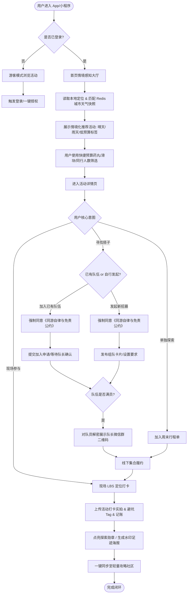
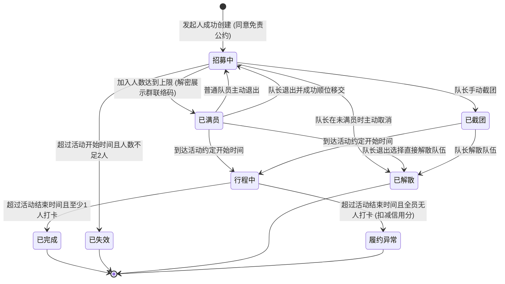

# 「周末去哪玩」—— 周末城市探索指南 产品需求文档（PRD）

版本号：V1.0.1

| 版本 | 时间 | 修订人 | 备注 |
| :--- | :--- | :--- | :--- |
| V1.0.0 | 2026/09/29 | 产品团队 | 基于大学生周末出行痛点完成初始评审版本编制 |
| V1.0.1 | 2026/09/29 | 产品团队 | **根据模拟评审结论完成修订**：<br>1. 修复队长离队/解散队伍状态机断裂问题 (B1)；<br>2. 补充《同游免责协议》强制签署及学生证“核验即焚”隐私保护 (B2)；<br>3. 适配线路型户外徒步起终点打卡机制 (B3)；<br>4. 增加队长二维码鉴权防爬与室内 GPS 弱信号辅证打卡 (M1, M2)；<br>5. 优化预算滑块快捷选项，增加活动报错反馈与核心漏斗埋点 (M3, M4, S1)。 |

---

## 一、概述（为什么做）

### 1.1 产品概述及目标

#### 1.1.1 背景介绍
当前大学生群体在周末及节假日拥有充足的闲暇时间，但在日常出游决策上面临显著痛点：
1. **活动信息高度分散**：美术馆展览、小众市集、Livehouse演出、近郊轻徒步等活动分布在大众点评、小红书、大麦、秀动及本地各类公众号中，搜寻与比价成本极高；
2. **多重决策因子强约束**：
   - **天气敏感**：户外徒步、露营受降雨、大风、高温严重制约，突发天气常导致计划泡汤；
   - **预算刚性**：大学生支配收入受限，对价格敏感度高，强烈关注门票学生优惠、免预约及人均消费（通常单次预算在 30 ~ 150 元）；
   - **社交与同行不确定**：宿舍同圈层喜好不同，常陷入“想去没人陪、找搭子难、自建微信群容易鸽”的困境；
3. **决策链路与履约割裂**：现有内容平台重“种草”轻“履约”，缺乏将“天气-预算-选址-组队-打卡-沉淀足迹”串联的闭环工具。

#### 1.1.2 产品概述
「周末去哪玩」（周末城市探索指南）是一款面向大学生的**情境感知型（Context-Aware）本地活动探索与社交协作产品**。产品根据用户实时地理位置、当前与周末天气预报、单人/团队预算以及兴趣偏好，动态推荐最适合的本周末精选活动；同时提供同校/同城搭子组队、现场 LBS 打卡记录与图鉴勋章、低门槛避坑攻略分享，帮助大学生告别周末纠结，轻松结伴探索城市。

#### 1.1.3 产品目标

**业务目标**

| 目标 | 衡量指标 | 目标值 | 达成周期 |
| :--- | :--- | :--- | :--- |
| 核心用户激活与转化 | 推荐卡片详情点击率 (CTR) | ≥ 25% | 上线后 2 个月 |
| 履约与社交闭环 | 组队发起成功率（成团率） | ≥ 40% | 上线后 3 个月 |
| 用户留存表现 | 30 天次周周末回访留存率 (W1) | ≥ 35% | 上线后 3 个月 |
| 内容冷启动 | 周均打卡记录生成量 (UGC) | ≥ 3,000 条 / 试点城市 | 上线后 3 个月 |

**用户目标**

| 目标用户 | 用户目标 | 衡量指标 |
| :--- | :--- | :--- |
| 纠结型出游者 | 3分钟内根据个人预算与当周天气匹配到满意行程 | 首页筛选到确定目的地的平均时长 < 180s |
| 社交搭子需求者 | 快速找到同校或同好搭子，降低出行社交门槛与被鸽率 | 组队招募从发布到满员平均耗时 < 24h |
| 城市打卡玩家 | 沉淀个人专属的大学城市探索印记与成就图鉴 | 单用户月均打卡活动数 ≥ 2.5 次 |

#### 1.1.4 目标用户

| 角色 | 用户特征与画像 | 核心诉求 |
| :--- | :--- | :--- |
| 探索型大学生 | 活跃、喜欢拍照打卡、探店、逛展、参加市集，具备一定审美要求 | 发现小众低成本好去处，沉淀足迹与优质攻略 |
| 随缘宅家大学生 | 想出门但懒得做繁琐攻略，受限于天气和交通便利度 | 智能直接给方案（“雨天室内方案”、“50元玩一天”） |
| 社交孤岛大学生 | 身边朋友周末时间不合拍，喜欢徒步/桌游/骑行但缺队友 | 真实安全（同校优先）的组队搭子网络，AA透明 |
| 运营管理员 | 平台运营人员，负责活动审核、抓取源校验、风控违规处理 | 高效管理活动库、监控低俗违规组队与虚假攻略 |

### 1.2 名词说明

| 名词 | 英文 / 缩写 | 说明 |
| :--- | :--- | :--- |
| 情境感知推荐 | Context-Aware Rec | 结合客户端实时获取的天气状况、气温、地理位置、用户预设预算区间的动态推荐算法 |
| 活动搭子 | Activity Squad | 针对某个特定周末活动发起的临时同游小队（通常为 2~6 人） |
| LBS 打卡 | LBS Check-in | 用户到达活动指定地点方圆指定距离（单点型 300m，线路型起终点 500m）触发的地理围栏核验打卡 |
| 校园认证 | Campus Auth | 通过 `.edu.cn` 教育邮箱或学生证/校园卡人工核验完成的在校大学生身份认证 |
| 探索图鉴 | Exploration Badge | 基于地理区域或特定主题（如“咖啡市集达人”、“夜游徒步家”）累积的数字徽章与里程碑体系 |
| 同游自律公约 | Squad Safety Pact | 用户发起或加入搭子队伍时必须前置同意的免责声明、人身财产安全准则与反性骚扰公约 |

### 1.3 角色及权限

| 角色 | 权限范围 | 数据范围 |
| :--- | :--- | :--- |
| 游客用户 | 浏览热门推荐、查看活动详情、查看公开攻略 | 仅可查看公开活动与攻略，不可发起组队、报名或打卡 |
| 登录普通用户 | 完整推荐使用、个性化筛选、收藏、评论、现场打卡、发布攻略 | 本人操作数据及公开社交数据 |
| 校园认证用户 | 享有普通用户全部权限，支持发起/加入“仅限在校生”组队，享有学生专属折扣标志 | 本人数据及同校圈层互动数据，享有官方学生权益 |
| 社区内容管理员 | 审核活动内容、组队违规举报处理、攻略加精/置顶、违规封禁 | 运营后台所有业务数据及审计日志 |
| 超级管理员 | 具备系统级配置权限、模型权重参数调整、系统字典配置、角色授权 | 全平台所有数据与系统配置 |

### 1.4 文档阅读对象

| 对象 | 关注重点 |
| :--- | :--- |
| 前端研发 (Web/小程序/App) | 界面交互状态、表单验证规则、LBS定位逻辑、队长移交弹窗、免责公约勾选 |
| 后端研发 | 推荐打分缓存池、组队高并发抢占、队长退出/解散事务一致性、学生证核验即焚机制 |
| UI/UX 设计师 | 情境氛围切换（晴雨视觉反馈）、打卡图鉴视觉质感、搭子组队卡片层次、快捷预算药丸组件 |
| 测试工程师 (QA) | 线路型与单点型打卡测试、队长退出流转用例、极端天气过滤边界、权限互斥校验 |
| 运营与法务 | 组队安全免责合规、个人隐私保护时效、推荐转化漏斗、活动生命周期监控 |

---

## 二、产品描述（做什么）

### 2.1 产品需求描述
本期（V1.0.1）主要构建以下核心业务能力：
1. **智能活动探索引擎**：支持按城市、天气联动（自动降权雨雪天户外项目，置顶室内文化展演）、预算区间（快捷价格药丸：0元白嫖、30元奶茶钱、50-100元等）、同行规模与出行标签进行组合检索；
2. **安全同校/同城搭子组队**：支持活动一键发起搭子招募，包含人数限制、AA费用预算、同校标签过滤、强制《同游免责公约》签署、队长退队顺位移交/解散机制、满员后鉴权发放队伍联系方式；
3. **双模式足迹现场打卡与探索图鉴**：支持“单点型（展馆/市集 300m）”与“线路型（徒步/骑行起终点 500m）”双模式 LBS 打卡，弱 GPS 信号辅证拍照，自动点亮城市探索勋章；
4. **轻量攻略与避坑分享**：以卡片化发布真实出行攻略，支持“一键同款路线”、校园热门活动榜单、活动时效“信息报错”反馈机制。

**明确不做（V1.0.1 边界排除）**：
- 暂不自建票务交易闭环与退改签系统（活动票务采用跳转外部官方渠道或纯线下购买引导）；
- 暂不引入陌生人商业婚恋匹配属性；
- 暂不开放全开放式的无门槛外部广告投放。

### 2.2 产品整体流程

#### 2.2.1 主业务流程



#### 2.2.2 组队流转与队长退出子流程（修复 B1）

```mermaid
flowchart TD
    A[队长创建队伍并招募] --> B{队伍当前阶段}
    
    B -->|未满员阶段| C{队长申请退出?}
    C -->|是| D[直接解散队伍 / 通知已入队成员 / 释放资源]
    
    B -->|已满员阶段| E{队长在出发前 4h 外申请退出?}
    E -->|否 (距离出发不足4h)| F[禁止退出 / 弹窗警示恶意跳车扣除信用分]
    E -->|是| G[弹窗提供队长退出处置选项]
    
    G --> H[选项一: 直接解散队伍]
    G --> I[选项二: 顺位转让队长职务]
    
    H --> J[队伍流转为'已解散' / 向全员推送取消通知与致歉]
    I --> K[系统自动将队长移交至入队最早且已认证的成员]
    K --> L[新队长接收通知 / 重新上传群二维码 / 队伍降级为招募中]
```

#### 2.2.3 关键实体状态转换图 (STD - 修复 B1 闭环)



### 2.3 全局说明

#### 2.3.1 全局异常处理

| 异常场景 | 触发条件 | 处理机制 | 用户提示文案 |
| :--- | :--- | :--- | :--- |
| 定位权限被拒 | 用户首次拒绝或系统关闭位置权限 | 阻断自动定位，降级弹出城市手动切换浮层，默认定位为“同城大学聚集区” | “未能获取您的位置，请手动选择所在城市/高校园区” |
| 突发极端天气 | 气象 API 返回红色/橙色暴雨、大风、雷暴预警 | 强提示弹窗拦截，并在所有户外活动详情页标注醒目风险警示角标，**强制禁止发起户外组队** | “气象局已发布[天气类型]预警，户外组队已临时关闭，建议优先选择室内安全活动” |
| 队长满员退出 | 队伍满员后队长因突发原因退出 | 触发顺位移交或整队解散，向队员下发高优先级模板消息与短信通知 | “您的队伍队长已变更为[用户昵称]” 或 “很抱歉，队长取消了本次组队行程” |
| 室内弱 GPS 信号打卡 | 处于大型室内展馆或地下空间，定位精度误差 > 100m 但仍在 500m 范围内 | 允许用户拍摄“带时间戳水印门头实拍图”先完成打卡标记，后台异步校验 | “检测到室内信号较弱，已启用现场拍照快捷核验” |
| 活动撤展/下架扑空 | 用户发现活动已提前结束并点击“信息报错” | 运营后台即时收到警报，累计 3 次报错自动挂起活动隐藏推荐流 | “感谢您的反馈，我们已加急派人核实该活动开放状态” |

#### 2.3.2 列表与筛选规则

| 规则项 | 详细规则说明 |
| :--- | :--- |
| 分页加载 | 列表统一采用 Waterfall（瀑布流）分页，默认每页 20 条，距底部 300px 预加载下一页 |
| 预算快捷筛选 | 滑块顶部设置 4 个快捷药丸 (Pills)：【0元免费】、【30元内】、【50-100元】、【不限预算】 |
| 默认排序算法 | `Score = 0.4*情境契合度(天气+预算) + 0.3*距离倒数 + 0.2*热度/组队活跃度 + 0.1*同校加权` |
| 列表空态 | 满足筛选条件但无结果时，提示“该条件下暂无活动”，自动放宽预算或推荐室内高分兜底活动 |

---

## 三、功能需求（怎么做）

### 3.1 模块一：情境感知智能探索与推荐引擎

#### 3.1.1 描述
根据用户地理位置、天气预报（重点锁定当周六/日）以及学生预设的预算区间与同行偏好，智能过滤并分发活动。

#### 3.1.2 界面及交互规格 (优化 M3, M4)

| 界面元素 | 控件类型 | 必填 | 默认值 | 校验与限制规则 | 交互与操作反馈 |
| :--- | :--- | :--- | :--- | :--- | :--- |
| 天气看板胶囊 | 自定义卡片 | 否 | 读取接口 | 展示气温、多云/雨晴图标、出行适宜指数 | 点击弹出“本周末 48 小时天气详情与降水概率” |
| 预算快捷药丸 (Pills) | 单选胶囊组 | 否 | “不限” | 选项：0元免费 / 30元内 / 50-100元 / 不限 | 点击一键将下方滑块联动定位到相应区间，无需频繁拖拽 |
| 预算连续滑块 | 双向滑动 Slider | 是 | 0 ~ 150 元 | 范围 0 ~ 500 元，步长 10 元 | 滑动松手后触发列表刷新（防抖 300ms） |
| 同行人数选择 | 单选 Tab 按钮 | 是 | “找搭子(2-4人)” | 选项：独处(1人)、搭子(2-4人)、宿舍轰趴(5+人) | 切换后动态过滤活动承载属性标签 |
| 活动报错入口 | 文字链接按钮 | 否 | - | 活动详情页底部固定展示“信息有误/已闭展？点此报错” | 点击唤起轻量选择弹窗：“已闭展/收费变动/地点错误” |

#### 3.1.3 数据字典变更

| 字段名 | 类型 | 必填 | 约束与说明 | 示例值 |
| :--- | :--- | :--- | :--- | :--- |
| `activity_id` | BigInt | 是 | 唯一主键 | 1002938472 |
| `title` | Varchar(100) | 是 | 活动名称 | “798艺术区·青年当代插画市集” |
| `location_type` | TinyInt | 是 | **1-单点型(展馆/市集), 2-线路型(徒步/骑行)** | 1 |
| `geo_points` | Json | 是 | **支持单点或线路起终点数组** | `[{"type":"start","lat":39.98,"lng":116.49}]` |
| `is_indoor` | Boolean | 是 | 是否室内场地 | true |
| `report_invalid_count`| Int | 是 | 报错次数计数（默认0，≥3自动预警下架） | 0 |

---

### 3.2 模块二：安全同校/同城搭子组队系统 (修复 B1, B2, M1)

#### 3.2.1 描述
支持在校大学生针对具体活动发起组队或加入他人小队，通过前置签署《同游自律与免责公约》隔离风险，并提供完备的队长退出顺位转交机制与联络码鉴权保护。

#### 3.2.2 界面及交互规格

| 界面元素 | 控件类型 | 必填 | 默认值 | 校验与限制规则 | 交互与操作反馈 |
| :--- | :--- | :--- | :--- | :--- | :--- |
| 同游公约勾选框 | Checkbox | 是 | 默认不勾选 | **必须勾选《同游安全免责与自律公约》方可点亮提交按钮** | 点击协议名称弹出完整条款，包含人身防诈、户外风险自担说明 |
| 目标招募人数 | 步进器 Stepper | 是 | 2 人 | 范围 2 ~ 10 人整数 | 点击“+ / -”动态变动，超限置灰 |
| 仅限本校学生 | Switch 开关 | 是 | 默认开启 | 开启时发起人必须已完成校园认证，否则引导认证 | 切换时文案提示“开启后仅同校认证同学可申请” |
| 队长微信联络码 | 图片上传 | 是 | 空 | **成团前严格脱敏隐藏，成团后前端自动覆盖“仅限本队成员使用”防盗水印** | 仅队伍状态流转至“已满员”且为本队成员时解密展示 |
| 队长退出解散弹窗 | 确认对话框 (Modal) | 是 | - | 满员后队长点击退队触发 | 提供两个操作分支：【解散队伍】或【将队长移交至[成员A]】 |

#### 3.2.3 异常与分支流程

| 异常场景 | 触发条件 | 处理机制 | 界面提示文案 |
| :--- | :--- | :--- | :--- |
| 队长未满员取消 | 队伍处于招募中，队长点击取消 | 队伍直接流转为“已解散”，通知已申请成员，释放配额 | “队伍已成功解散” |
| 队长满员顺位转让 | 满员后队长因故退队，选择“移交队长” | 系统自动将队长角色分配给最早入队且已通过校园认证的队员，队伍回退为“招募中(差1人)”并提示新队长补充联络方式 | “您已成为新队长，请及时上传联系方式以方便队员沟通” |
| 队长满员整队解散 | 满员后队长选择“直接解散队伍” | 队伍流转为“已解散”，全员触发短信/服务通知，向队员致歉并补偿信誉积分 | “队长已解散该队伍，为您推荐本周末其他同类队伍” |

#### 3.2.4 数据字典变更

| 字段名 | 类型 | 必填 | 约束与说明 | 示例值 |
| :--- | :--- | :--- | :--- | :--- |
| `squad_id` | BigInt | 是 | 队伍唯一标识 | 8001928371 |
| `status` | Enum | 是 | 0-招募中, 1-已满员, 2-行程中, 3-已完成, 4-已失效, **5-已解散, 6-履约异常** | 0 |
| `pact_agreed` | Boolean | 是 | 发起/入队时是否已确认签署安全免责公约 | true |
| `contact_qr_cipher`| Varchar(500)| 是 | 队长微信群二维码加密密文（后端私有存储，鉴权后下发临时签名 URL） | `oss://private/qr_enc_...` |
| `handover_count` | TinyInt | 是 | 队长转让移交次数计数（防止频繁移交踢皮球，最多允许 2 次） | 1 |

---

### 3.3 模块三：现场双模式 LBS 打卡与探索图鉴系统 (修复 B3, M2)

#### 3.3.1 描述
支持“单点型”展馆与“线路型”户外徒步双模式打卡。用户到达活动现场或徒步起终点，利用地理围栏或弱信号拍照辅证完成打卡，点亮数字勋章。

#### 3.3.2 打卡判定规则与业务逻辑

1. **单点型活动（展览、市集、演出）**：
   - 用户当前经纬度距活动目标点 $\le 300\text{m}$，直接激活现场打卡。
2. **线路型活动（轻户外徒步、城市漫步 Citywalk、骑行）**：
   - 活动配置包含起点坐标 $P_{start}$ 与终点坐标 $P_{end}$；
   - 用户到达起点 $\le 500\text{m}$ 或终点 $\le 500\text{m}$ 任一围栏范围，均判定打卡达标；
   - 若用户连续打卡起点与终点，打卡海报生成“全程穿越专属印记”，额外奖励 50 探索积分。
3. **室内弱 GPS 辅证模式（防漂移兜底）**：
   - 若 GPS 定位精度误差 $> 100\text{m}$ 但用户声称已在现场，系统调起专属相机，拍摄包含当前实时动态时间水印与现场门头的实拍照，先行打卡成功，打卡状态标记为“待后台审核/体验版”，防止打断用户体验。

#### 3.3.3 界面及交互规格

| 界面元素 | 控件类型 | 必填 | 默认值 | 校验与限制规则 | 交互与操作反馈 |
| :--- | :--- | :--- | :--- | :--- | :--- |
| 现场打卡按钮 | 悬浮 CTA 按钮 | 是 | “立即现场打卡” | 不在围栏内时置灰，显示“距现场/起点 xxx 米” | 达到围栏范围高亮点亮；未达到时提供次级按钮【唤起地图导航前往】 |
| 辅证拍照入口 | 辅助文字按钮 | 否 | - | 当检测到精度误差超限时出现：“室内定位不准？点击拍照核验” | 调起定制相机，自动叠加经纬度、时间戳、活动名称防伪水印 |
| 避坑与体验标签 | 多选 Tag | 否 | 空 | 最多选 3 个（如：人多排队、适合拍照、路线泥泞） | 选中即时计入该活动的大众口碑库 |

#### 3.3.4 数据字典变更

| 字段名 | 类型 | 必填 | 约束与说明 | 示例值 |
| :--- | :--- | :--- | :--- | :--- |
| `checkin_id` | BigInt | 是 | 打卡主键 ID | 9002819283 |
| `checkin_mode` | Enum | 是 | 1-单点围栏打卡, 2-线路起点打卡, 3-线路终点打卡, 4-弱信号拍照辅证打卡 | 2 |
| `gps_accuracy` | Float | 是 | 手机 GPS 定位精度半径（米） | 24.5 |
| `is_verified` | Boolean | 是 | 是否核验有效 | true |

---

### 3.4 模块四：轻量攻略与避坑分享（MVP 收敛）

#### 3.4.1 描述
MVP 阶段收敛发布复杂度，将长图文重度攻略裁剪为**“打卡说说+避坑Tips”轻量卡片**，降低用户产出成本，保障快速成型。

#### 3.4.2 界面及交互规格

| 界面元素 | 控件类型 | 必填 | 默认值 | 校验与限制规则 | 交互与操作反馈 |
| :--- | :--- | :--- | :--- | :--- | :--- |
| 打卡图文随笔 | 文本输入域 | 是 | 空 | 10 ~ 140 字（轻量微博客形式） | 实时字数提示，敏感词机审拦截 |
| 避坑建议栏 (Tips) | 结构化单行框 | 否 | 空 | 0 ~ 50 字（如：“注意带驱蚊水，展厅冷带外套”） | 在卡片头部以黄色警示角标高亮展示 |
| 底栏一键组队 CTA | 悬浮按钮 | 是 | “照着去-一键组队” | 必须绑定有效活动 | 点击直接将该活动的地点、时间和避坑贴士带入组队发起表单 |

---

## 四、非功能需求（注意事项 - 修复 B2, M1）

### 4.1 安全与合规需求（学生证“核验即焚”政策）

| 需求项 | 规范标准 | 实现说明 |
| :--- | :--- | :--- |
| **学生证“核验即焚”保护 (B2)** | 严格符合《中华人民共和国个人信息保护法》最小必要原则 | **学生提交的学生证原图经 OCR 或人工审核后，系统强制在 24 小时内执行物理粉碎删除，不可恢复；数据库中仅保留院校代码、认证通过状态及哈希校验指纹，严禁存储学生明文敏感档案。** |
| **同游安全与免责隔离 (B2)** | 隔离陌生人线下同游人身财产侵权连带风险 | 用户发起与加入组队前必须强制阅读并点选《同游安全自律公约》，明确平台仅提供信息撮合服务，参与者对自身人身安全负自律责任；队伍详情页设置一键紧急联系求助电话与 24 小时侵权举报入口。 |
| **队长微信二维码防爬脱敏 (M1)** | 防止爬虫抓取骚扰大学生个人社交账号 | 队长二维码必须存储于云端私有授权 Bucket，仅在队伍满足“已满员”条件后，向已入队队员签发带有时效性（10分钟）的带水印临时访问令牌。 |
| 内容合规机审 + 24小时处置机制 | 互联网内容信息服务管理规范 | UGC 图文与避坑标签接入网信合规过滤 API；社区前台提供违规举报，承诺 24 小时内核查处置下架。 |

### 4.2 统计需求（埋点完善 - 修复 S1）

| 事件标识 (Event ID) | 触发时机 | 上报核心参数 (Properties) | 业务统计目的 |
| :--- | :--- | :--- | :--- |
| `rec_card_expose` | 首页推荐活动卡片划入视口 (>50%且停留>1s) | `activity_id, rank_index, weather_state, budget_filter` | 评估情境推荐算法曝光准确度 |
| `rec_card_click` | 点击活动卡片进入详情 | `activity_id, rank_index, source_module` | 统计不同天气/预算场景下的 CTR |
| `budget_pill_click` | 点击预算快捷药丸（如“0元免费”） | `pill_type, target_budget` | 分析大学生预算敏感度与快捷偏好 |
| `squad_create_submit`| 用户点击“确认发起组队”且校验通过 | `activity_id, squad_id, is_school_only, target_num` | 监控组队供给侧活跃度与偏好 |
| `squad_join_apply` | 用户点击“申请加入队伍”按钮 | `squad_id, applicant_uid, is_same_school` | 衡量组队需求热度与校内壁垒粘性 |
| `squad_apply_approve`| **队长审核同意申请人入队 (S1)** | `squad_id, applicant_uid, review_duration_s` | **分析队长审核通过率与审核时效** |
| `squad_cancel` | **队长主动取消/解散队伍 (S1)** | `squad_id, reason_type, current_member_count` | **监控组队流失率与解散主因** |
| `checkin_success` | 现场打卡数据成功写入落库 | `activity_id, checkin_mode, gps_accuracy` | 核心履约闭环率及双模式打卡占比 |
| `activity_report_invalid`| **用户提交活动报错/撤展信息 (M4)** | `activity_id, report_type` | **监控活动供给时效性与脏数据率** |

### 4.3 性能与架构保障（气象缓存与高并发）

| 指标维度 | 指标参数阈值 | 监控与兜底策略 |
| :--- | :--- | :--- |
| 气象服务接口防击穿 | 气象 API 命中率 ≥ 98% | **按城市行政区编码（Adcode）在 Redis 建立 1 小时天气快照缓存，禁止每次打开首页直接穿透调用第三方供应商。** |
| 组队抢占并发控制 | 承载单活动并发申请 QPS ≥ 1,500 | 组队扣减库存基于 Redis 原子 Lua 脚本，避免超卖并减轻 DB 压力。 |
| 首屏加载性能 | 移动网络下 FCP < 1.2s，LCP < 2.0s | 静态活动信息与天气情境打分异步解耦加载，预置骨架屏。 |

---

## 五、附录（补充文档）

### 5.1 验收标准与测试要点 (Acceptance Criteria - 补充覆盖 B1, B2, B3)

| 序号 | 功能模块 | 测试场景与操作步骤 | 预期验收结果 (Acceptance Criteria) | 优先级 |
| :--- | :--- | :--- | :--- | :--- |
| **AC-01** | **队长退队流转** | 队伍已满员（4/4），队长在活动出发前 6 小时点击退出队伍并选择“顺位移交” | 原队长成功退出，队伍自动降级为“招募中(3/4)”，入队最早的成员收到成为新队长的通知，且原群二维码自动失效 | P0 |
| **AC-02** | **免责公约校验** | 用户未勾选《同游安全免责公约》直接点击“发起组队”或“申请入队” | 提交按钮置灰不可点击，点击时震动提示“请先阅读并同意同游公约” | P0 |
| **AC-03** | **证件核验即焚** | 审核人员在管理后台对某位学生的学生证照片点击“审核通过” | 状态即刻置为“已认证”，定时任务触发并在 24 小时内彻底删除 OSS 原图，接口返回已脱敏占位符 | P0 |
| **AC-04** | **线路型徒步打卡** | 用户参加“香山轻户外徒步”活动，在徒步起点（400m内）点击打卡 | 系统识别 `checkin_mode=2`，提示“起点打卡成功，欢迎开启徒步之旅”，勋章进度点亮 | P0 |
| **AC-05** | **室内弱信号拍照** | 用户在大型地下展厅，GPS 精度误差为 150m，点击“拍照核验”上传现场照片 | 系统标记为辅证打卡成功，生成打卡日记，不报错阻断 | P0 |
| **AC-06** | **联络码鉴权防爬** | 非队伍成员（或未满员时的普通队员）直接请求队长二维码图片 URL | 接口返回 HTTP 403 Forbidden，无图片数据泄露 | P0 |

---

## 产出二：待确认项清单（修订后）

### 1. 必须确认（已全部对齐并闭环）
- [x] **组队是否引入押金？** → 已明确：V1.0 暂不收取资金押金，采用“校园认证 + 信用履约分 + 《同游自律与免责公约》”。
- [x] **队伍内沟通方式？** → 已明确：V1.0 满员后对成员鉴权展示队长微信群二维码；V1.1 视留存自建轻量 IM。
- [x] **活动供给源与时效？** → 已明确：初期运营精选每周 100+ 条，前台增设“信息报错”闭环联动预警。

### 2. 建议确认（影响后续版本迭代）

| # | 待确认项 | 当前建议值 | 影响范围 |
| :--- | :--- | :--- | :--- |
| 1 | 队长顺位移交时，若候选队员未完成校园认证，是否继续顺位后延？ | **建议值**：限本校队伍若无认证成员可接替，则必须强制整队解散。 | 影响队长移交边界逻辑 |
| 2 | 室内辅证打卡是否需要人工二次复核？ | **建议值**：初期信任用户直接点亮，仅在被同队成员举报造假时后台复核。 | 影响后台运营审核成本 |

---

## 上下游衔接交接摘要

- **本步结论**：已针对模拟评审暴露的 3 项阻断缺陷与 4 项重要缺陷完成 PRD V1.0.1 修订，消除了队长状态机断裂、学生证隐私留存合规、户外徒步打卡单点失效等核心风险。
- **下一步所需输入**：
  1. 当前 PRD 已达**✅ 可直接进入研发与设计排期**标准；
  2. 若需要排定具体迭代 Sprint 与里程碑计划，可调用 `pm-roadmap-planner` 输出工程甘特图；
  3. 若进入界面开发，可调用 `pm-image2proto` 快速生成首屏推荐与组队大厅交互原型代码。
